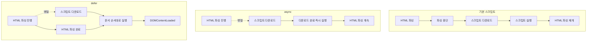

# 1장. HTML과 웹 기본 구조

## Q1. HTML이란 무엇인가요?

### 면접 답변

HTML은 **HyperText Markup Language**의 약자로, 웹 문서의 구조와 의미를 정의하는 마크업 언어입니다. 제목, 본문, 링크, 이미지 등의 콘텐츠를 태그로 표현하며, 브라우저는 이를 해석해 DOM을 구성합니다. 의미에 맞는 태그를 사용하면 검색 엔진과 보조 기술도 문서 구조를 더 정확하게 이해할 수 있습니다.

### 핵심 개념

- **HyperText**: 특정 단어나 문장에 링크를 부여하여 다른 문서나 페이지로 즉시 이동할 수 있게 만든 텍스트
- **Markup**: 약속된 태그를 사용해 문서의 구조와 각 콘텐츠의 의미를 표시하는 방식
- **HTML의 역할**: 단순한 화면 표시를 넘어 제목, 본문, 목록 등 정보의 구조와 의미를 표현
- **태그와 요소의 차이**: 태그는 `<p>`, `</p>`와 같은 마크업 문법이고, 요소는 태그와 속성, 콘텐츠를 포함하는 구조적 단위
- **HTML과 DOM의 차이**: HTML은 문서의 원본 마크업이고, DOM은 브라우저가 HTML을 파싱하여 메모리에 구성한 객체 트리
- **브라우저의 처리**: HTML 소스를 토큰으로 분석하고 각 토큰을 노드로 변환하여 DOM 트리를 구성
- **파서의 오류 복구**: 누락되거나 잘못 배치된 마크업을 브라우저가 정해진 규칙에 따라 보정하므로 원본 HTML과 최종 DOM이 달라질 수 있음
- **의미와 표현의 분리**: `<strong>`은 콘텐츠의 중요성을 나타내고 `font-weight: bold`는 시각적인 굵기만 변경
- **시맨틱 HTML**: `header`, `nav`, `main`, `article`처럼 콘텐츠의 역할이 드러나는 태그를 사용하여 검색 엔진과 보조 기술의 문서 이해를 지원

### 모의 면접

**1. 웹 개발에서 HTML, CSS, 자바스크립트의 역할은 무엇인가요? 건물 짓기에 비유하면 각각 어떤 부분에 해당할까요?**

- HTML은 건물의 골조와 공간 구조에 해당합니다.
- CSS는 건물의 색상, 배치, 인테리어에 해당합니다.
- JavaScript는 문, 엘리베이터처럼 사용자 입력에 반응하는 기능에 해당합니다.

**2. HTML에서 시맨틱 태그를 사용하는 이유는 무엇인가요? 이것이 검색 엔진 최적화(SEO)와 웹 접근성에 어떤 도움을 줄까요?**

시맨틱 태그는 콘텐츠의 역할과 문서 구조를 태그 이름으로 전달합니다. 따라서 검색 엔진은 중요한 콘텐츠를 더 정확히 파악할 수 있고, 스크린 리더와 같은 보조 기술은 사용자에게 문서의 구조와 탐색 정보를 올바른 순서와 맥락으로 제공할 수 있습니다.

## Q2. HTML의 Doctype은 어떤 역할을 하나요?

### 면접 답변

Doctype은 브라우저가 HTML 문서를 웹 표준에 맞는 `no-quirks` 모드로 렌더링하도록 지정하는 선언입니다. HTML 문서의 첫 줄에 `<!DOCTYPE html>`을 작성하며, 선언이 없거나 잘못되면 브라우저가 과거 웹페이지와의 호환성을 위한 쿼크 모드로 렌더링하여 의도하지 않은 레이아웃 차이가 발생할 수 있습니다.

### 핵심 개념

- **정식 명칭**: Document Type Declaration, 문서 형식 선언
- **작성 위치**: `<html>` 태그보다 앞선 HTML 문서의 첫 줄
- **HTML5 선언**: `<!DOCTYPE html>`
- **현대 Doctype의 목적**: HTML 버전을 선택하는 것이 아니라 브라우저의 `no-quirks` 모드를 활성화
- **문서 모드**: `no-quirks`, `limited-quirks`, `quirks` 세 가지 모드
- **no-quirks 모드**: 현대 HTML과 CSS 표준에 따라 문서를 렌더링하는 모드
- **limited-quirks 모드**: 대부분 표준을 따르면서 일부 레거시 레이아웃 동작만 유지하는 모드
- **쿼크 모드**: 오래된 웹페이지와의 호환성을 위해 과거 브라우저의 동작을 일부 재현하는 렌더링 모드
- **선언 목적**: 브라우저별 렌더링 차이와 의도하지 않은 레이아웃 문제 예방
- **DOM에서의 표현**: HTML 요소는 아니지만 DOM에 `DocumentType` 노드로 존재하며 `document.doctype`으로 접근 가능
- **렌더링 모드 확인**: `document.compatMode`가 `"BackCompat"`이면 quirks, `"CSS1Compat"`이면 no-quirks 또는 limited-quirks
- **과거 Doctype과의 차이**: HTML4와 XHTML은 DTD 식별자를 포함했지만 현대 HTML의 Doctype은 DTD를 참조하지 않음

> 참고: [MDN - 쿼크 모드와 표준 모드 이해하기](https://developer.mozilla.org/ko/docs/Web/HTML/Guides/Quirks_mode_and_standards_mode)

### 모의 면접

**1. Doctype 선언이 웹 브라우저의 렌더링 모드에 어떤 영향을 미칠까요?**

`<!DOCTYPE html>`을 올바르게 선언하면 브라우저가 `no-quirks` 모드로 문서를 렌더링합니다. 선언이 없거나 잘못되면 쿼크 모드를 사용하고, 일부 과거 Doctype은 `limited-quirks` 모드를 유발할 수 있습니다. 쿼크 모드에서는 CSS 박스 모델이나 레이아웃 계산 방식이 표준과 다르게 동작할 수 있습니다.

**2. 렌더링 모드에는 어떤 것이 있나요? 각각의 모드는 어떤 점이 다른가요?**

문서 모드는 `no-quirks`, `limited-quirks`, `quirks`로 나뉩니다. `no-quirks`는 현대 웹 표준에 따라 렌더링하고, `quirks`는 오래된 페이지와의 호환성을 위해 과거 브라우저의 동작을 재현합니다. `limited-quirks`는 대부분 표준 모드처럼 동작하지만 일부 레거시 레이아웃 규칙을 유지합니다. JavaScript에서는 `document.compatMode`로 쿼크 모드 여부를 확인할 수 있지만 `no-quirks`와 `limited-quirks`를 구분할 수는 없습니다.

**3. HTML4/XHTML의 Doctype 선언과 HTML5 Doctype 선언은 어떤 차이가 있나요? Doctype 선언이 HTML5에서 단순한 형태가 된 이유는 무엇인가요?**

HTML4와 XHTML은 문서가 따르는 DTD를 명시해야 했기 때문에 Doctype 선언이 길고 복잡했습니다. HTML5는 특정 DTD를 참조하지 않으며, 브라우저를 표준 모드로 동작시키는 데 필요한 최소한의 선언만 사용하므로 `<!DOCTYPE html>`이라는 간단한 형태가 되었습니다.

## Q3. `<head>` 태그 안에는 어떤 태그를 사용하나요?

### 면접 답변

`<head>`는 문서의 제목, 문자 인코딩, 화면 설정, 설명과 외부 리소스처럼 브라우저와 검색 엔진이 처리할 메타데이터를 담는 영역입니다. 주로 `<title>`, `<meta>`, `<link>`, `<style>`, `<script>`를 사용합니다. 이 정보는 본문에 직접 표시되지는 않지만 페이지의 렌더링, 검색 결과, 반응형 동작과 사용자 경험에 영향을 줍니다.

### 핵심 개념

- **`<head>`**: 문서의 메타데이터와 외부 리소스 정보를 담는 영역
- **`<title>`**: 브라우저 탭과 검색 결과 등에 사용되는 문서 제목
- **`<meta charset="UTF-8">`**: 문서의 문자 인코딩 지정과 글자 깨짐 방지
- **`<meta name="viewport">`**: 모바일 기기의 화면 너비와 배율 설정
- **`<meta name="description">`**: 검색 결과에서 페이지 내용을 설명하는 요약문으로 활용될 수 있는 정보
- **Open Graph 메타데이터**: SNS에 링크를 공유할 때 표시할 제목, 설명, 대표 이미지 설정
- **`<link>`**: 외부 스타일시트, 파비콘 등의 리소스 연결
- **`<style>`**: HTML 문서 내부에 CSS 스타일 선언
- **`<script>`**: 외부 또는 인라인 스크립트 연결과 실행
- **일반 스크립트**: `async`나 `defer`가 없으면 스크립트를 실행하는 동안 HTML 파싱을 중단
- **`defer`**: HTML 파싱과 병렬로 다운로드한 뒤 파싱 완료 후 문서 순서대로 실행
- **`async`**: HTML 파싱과 병렬로 다운로드하고 준비되는 즉시 실행하며 실행 순서를 보장하지 않음
- **모듈 스크립트**: `type="module"`을 사용하며 기본적으로 지연 실행
- **`<base>`**: 문서에서 사용하는 모든 상대 URL의 기준 URL 또는 기본 탐색 대상 지정
- **`<title>`과 `<h1>`의 차이**: `<title>`은 문서 자체의 제목을 나타내는 메타데이터, `<h1>`은 본문에 표시되는 최상위 제목
- **사용 개수**: HTML 문서당 하나의 `<head>`, 일반적인 문서에서는 하나의 `<title>`

#### 스크립트 로딩 방식



| 구분      | 다운로드              | 실행 시점                              | 실행 순서   | 적합한 경우                        |
| ------- | ----------------- | ---------------------------------- | ------- | ----------------------------- |
| 기본      | HTML 파싱을 멈추고 다운로드 | 다운로드 직후                            | 문서 순서   | 즉시 실행이 반드시 필요한 작은 스크립트        |
| `async` | HTML 파싱과 병렬       | 다운로드 완료 즉시                         | 보장되지 않음 | 광고·분석처럼 다른 코드와 독립적인 스크립트      |
| `defer` | HTML 파싱과 병렬       | HTML 파싱 완료 후, `DOMContentLoaded` 전 | 문서 순서   | DOM이나 다른 스크립트에 의존하는 애플리케이션 코드 |

- **기본 스크립트**: 브라우저가 `<script>`를 만나면 HTML 파싱을 멈추고 스크립트를 다운로드·실행한 뒤 파싱을 재개
- **`async` 실행**: 다운로드 중에는 HTML 파싱을 계속하지만 다운로드가 끝나면 파싱을 잠시 멈추고 즉시 실행
- **`async` 순서**: 네트워크에서 먼저 준비된 스크립트부터 실행되므로 선언 순서와 달라질 수 있음
- **`defer` 실행**: HTML 파싱이 끝난 뒤 실행되므로 문서 뒤쪽의 DOM 요소에 접근 가능
- **`defer` 순서**: 여러 스크립트가 있을 때 문서에 작성된 순서대로 실행
- **`DOMContentLoaded`와의 관계**: 모든 `defer` 스크립트의 실행이 끝난 뒤 `DOMContentLoaded` 이벤트 발생
- **인라인 스크립트**: `src`가 없는 일반 인라인 스크립트에서는 `defer`가 동작하지 않음
- **속성 동시 사용**: `async`와 `defer`를 함께 지정하면 최신 브라우저에서는 `async` 방식으로 동작
- **모듈 스크립트**: `type="module"`은 기본적으로 `defer`와 유사하게 HTML 파싱 완료 후 실행

> 참고: [MDN - `<head>` HTML 요소](https://developer.mozilla.org/ko/docs/Web/HTML/Reference/Elements/head)

### 모의 면접

**1. `<head>` 태그 안에 자주 사용하는 주요 태그(`<title>`, `<meta>`, `<link>`, `<style>`, `<script>`)는 각각 어떤 역할을 하나요?**

- `<title>`은 문서의 제목을 정의하여 브라우저 탭 등에 표시합니다.
- `<meta>`는 문자 인코딩, 뷰포트, 페이지 설명 등의 메타데이터를 제공합니다.
- `<link>`는 CSS나 파비콘 같은 외부 리소스와 문서의 관계를 정의합니다.
- `<style>`은 문서 내부에 CSS를 작성할 때 사용합니다.
- `<script>`는 JavaScript 파일을 연결하거나 스크립트를 직접 작성할 때 사용합니다.

**2. `<head>` 태그의 설정은 검색 엔진 최적화와 사용자 경험(UX)에 왜 중요한 영향을 미치나요?**

`<title>`과 description 메타데이터는 검색 엔진이 페이지의 주제와 요약을 파악하는 데 도움을 주고 검색 결과의 제목과 설명으로 사용될 수 있습니다. 문자 인코딩은 글자 깨짐을 방지하고, viewport 설정은 모바일 화면에서 적절한 크기로 페이지가 표시되도록 합니다. 스타일시트와 스크립트의 로딩 방식도 초기 렌더링과 상호작용 시점에 영향을 주기 때문에 사용자 경험과 관련이 있습니다.

특히 일반 스크립트는 HTML 파싱을 막을 수 있으므로 의존성과 실행 순서에 따라 `defer` 또는 `async`를 선택해야 합니다.

> 참고: [MDN - `<script>` HTML 요소](https://developer.mozilla.org/ko/docs/Web/HTML/Reference/Elements/script)

## Q4. 시맨틱 태그란 무엇이고, 사용하는 이유를 설명할 수 있나요?

### 면접 답변

시맨틱 태그는 태그 이름만으로 콘텐츠의 의미와 역할을 나타내는 HTML 태그입니다. `<header>`, `<nav>`, `<main>`, `<article>`, `<section>`, `<footer>` 등이 대표적입니다.

의미 없이 영역을 구분하는 `<div>`와 달리, 시맨틱 태그를 사용하면 브라우저와 검색 엔진, 스크린 리더가 문서의 구조를 더 정확하게 이해할 수 있습니다. 그 결과 웹 접근성과 검색 엔진 최적화에 도움이 되고, 개발자도 코드의 구조를 빠르게 파악할 수 있어 가독성과 유지보수성이 좋아집니다.

### 핵심 개념

#### 시맨틱의 의미

- **시맨틱**: 요소의 모양이 아닌 목적과 역할을 표현하는 HTML 구조
- **`<main>`**: 문서의 핵심 콘텐츠
- **`<nav>`**: 주요 탐색 링크
- **`<article>`**: 독립적으로 배포하거나 재사용할 수 있는 콘텐츠
- **`<section>`**: 하나의 주제로 묶인 독립적인 구역
- **`<aside>`**: 본문과 간접적으로 관련된 부가 콘텐츠
- **`<header>`**: 페이지 또는 섹션의 소개와 탐색 정보
- **`<footer>`**: 페이지 또는 가장 가까운 섹션의 작성자, 저작권, 관련 링크 정보

#### 시맨틱 요소와 비시맨틱 요소

```html
<!-- 역할을 태그만으로 알기 어려운 구조 -->
<div class="header">...</div>
<div class="navigation">...</div>
<div class="main">...</div>

<!-- 역할이 태그에 드러나는 구조 -->
<header>...</header>
<nav>...</nav>
<main>...</main>
```

- **`<div>`, `<span>`**: 콘텐츠의 역할을 나타내지 않는 범용 컨테이너
- **시맨틱 태그**: 태그 이름을 통해 영역의 목적과 구조 전달
- **`<div>`의 용도**: 별도의 의미가 없는 스타일링과 레이아웃용 래퍼
- **요소 선택 기준**: 기본 스타일이나 시각적 모양이 아닌 콘텐츠의 의미

#### 시맨틱 HTML과 검색 엔진

- **크롤링**: 검색 엔진이 웹페이지를 발견하고 가져오는 과정
- **인덱싱**: 수집한 페이지의 콘텐츠와 구조를 분석하여 검색 색인에 저장하는 과정
- **시맨틱 태그의 역할**: 주요 콘텐츠, 탐색 영역, 독립적인 글, 부가 콘텐츠의 의미와 관계를 파악할 수 있는 단서
- **문서 계층 전달**: 제목 구조와 함께 콘텐츠의 관계와 맥락 표현
- **검색 순위와의 관계**: 시맨틱 태그 자체가 검색 순위를 직접 보장하지 않으며 검색 엔진의 콘텐츠 이해를 돕는 기반
- **SEO의 범위**: 의미 있는 문서 구조뿐만 아니라 콘텐츠 품질, 제목, 링크, 모바일 사용성 등 여러 요소의 영향

#### `<article>`과 `<section>`의 구분

| 요소          | 선택 기준                              |
| ----------- | ---------------------------------- |
| `<article>` | 해당 부분만 떼어도 독립적인 콘텐츠로 이해하거나 재사용 가능  |
| `<section>` | 하나의 주제를 가진 문서의 구역이며 일반적으로 제목을 포함   |

- **`<article>`의 사례**: 블로그 게시글, 뉴스 기사, 댓글처럼 독립적으로 배포할 수 있는 콘텐츠
- **`<section>`의 사례**: 하나의 문서 안에서 주제별 내용을 구분하는 영역

> 참고: [MDN - 시맨틱](https://developer.mozilla.org/ko/docs/Glossary/Semantics), [MDN - HTML 요소 참고서](https://developer.mozilla.org/ko/docs/Web/HTML/Reference/Elements), [MDN - 검색 엔진](https://developer.mozilla.org/ko/docs/Glossary/Search_engine), [Google 검색 센터 - SEO 기본 가이드](https://developers.google.com/search/docs/fundamentals/seo-starter-guide?hl=ko)

### 모의 면접

**1. `<header>`, `<main>`, `<article>`과 같은 시맨틱 태그를 사용하면 검색 엔진 최적화와 웹 접근성에 어떤 이점이 있을까요?**

검색 엔진은 시맨틱 태그를 통해 페이지의 주요 콘텐츠와 각 영역의 역할을 더 명확하게 파악할 수 있습니다. 이를 바탕으로 콘텐츠의 구조와 맥락을 이해하는 데 도움을 받을 수 있습니다.

스크린 리더와 같은 보조 기술은 시맨틱 태그를 통해 각 영역의 의미와 문서 구조를 사용자에게 더 정확하게 전달할 수 있습니다.

**2. `<div>` 태그 대신 시맨틱 태그를 사용하는 것이 코드 가독성과 유지보수성 측면에서 왜 더 유리할까요?**

`<div>`는 자체적인 의미가 없기 때문에 클래스나 아이디를 확인해야 영역의 역할을 알 수 있습니다. 반면 시맨틱 태그는 태그 이름만으로도 콘텐츠의 역할과 문서 구조를 파악할 수 있습니다.

따라서 다른 개발자가 코드를 읽을 때 이해하기 쉽고, 기능 수정이나 구조 변경이 필요한 위치도 빠르게 찾을 수 있어 협업과 유지보수에 유리합니다. 다만 의미에 맞는 태그가 없고 단순히 스타일이나 레이아웃을 위한 컨테이너가 필요하다면 `<div>`를 사용하는 것이 적절합니다.

## Q5. 웹 표준과 웹 접근성이란 무엇인가요?

### 면접 답변

웹 표준은 브라우저와 기기 등의 환경이 달라도 웹 기술이 일관되게 해석되고 동작하도록 정한 공통 규칙과 명세입니다. 표준을 준수하면 호환성과 유지보수성이 높아지고 예측 가능한 웹페이지를 만들 수 있습니다.

웹 접근성은 장애 여부나 사용 환경과 관계없이 누구나 웹 콘텐츠를 인식하고 조작하며 이해할 수 있도록 만드는 원칙입니다. 의미에 맞는 HTML 요소, 이미지의 대체 텍스트, 키보드로 조작할 수 있는 인터페이스 등을 통해 접근성을 높일 수 있습니다.

웹 표준 준수는 접근성 구현의 기반이 되지만, 표준에 맞는 코드라고 해서 자동으로 접근성이 보장되는 것은 아닙니다. 실제 사용자가 콘텐츠를 이용할 수 있는지까지 함께 고려해야 합니다.

### 핵심 개념

#### 웹 표준

- **웹 표준**: 다양한 브라우저와 환경에서 웹 기술이 일관되게 동작하도록 정한 공통 명세와 규칙
- **상호 운용성**: 특정 브라우저나 기기에 종속되지 않는 동일한 콘텐츠와 기능 제공
- **호환성**: 현재와 미래의 브라우저 및 사용자 에이전트에서 예측 가능한 동작
- **유지보수성**: 표준화된 구조를 통한 코드 이해와 수정 비용 감소
- **관심사의 분리**: 문서 구조, 표현, 동작을 각 기술의 역할에 맞게 구성
- **대표 표준**: HTML, CSS, DOM, ECMAScript, WCAG 등

#### 웹 접근성

- **웹 접근성**: 장애 여부, 기기, 입력 방식, 일시적 또는 상황적 제약과 관계없이 웹을 이용할 수 있도록 보장하는 원칙
- **대상 범위**: 시각, 청각, 지체, 인지 장애뿐만 아니라 일시적 부상, 밝은 야외, 소리를 들을 수 없는 환경 등 포함
- **보조 기술**: 스크린 리더, 화면 확대 프로그램, 음성 입력 장치, 스위치 장치 등
- **주요 목표**: 콘텐츠 인식, 기능 조작, 정보 이해, 다양한 브라우저와 보조 기술에서의 안정적인 해석

#### 웹 표준과 웹 접근성의 관계

| 구분 | 웹 표준 | 웹 접근성 |
| --- | --- | --- |
| 목적 | 웹 기술의 일관된 해석과 동작 | 누구나 웹 콘텐츠와 기능을 이용할 수 있도록 보장 |
| 주요 관점 | 브라우저 호환성, 상호 운용성, 유지보수성 | 사용자 다양성, 보조 기술, 입력 방식 |
| 대표 기준 | HTML, CSS, DOM 등의 기술 명세 | WCAG, WAI-ARIA 등의 접근성 지침 |
| 관계 | 접근성을 구현할 수 있는 기술적 기반 | 표준 기술을 사용자 관점에서 올바르게 적용 |

- **표준 준수와 접근성의 차이**: 문법적으로 올바른 HTML이라도 대체 텍스트나 키보드 접근이 없다면 낮아질 수 있는 접근성
- **접근성과 표준의 연결**: 시맨틱 HTML과 표준 컨트롤을 통한 브라우저와 보조 기술의 일관된 정보 제공

#### WCAG의 네 가지 원칙

- **WCAG 2.2**: 웹 콘텐츠 접근성 지침의 현재 권고안, 인식 가능·운용 가능·이해 가능·견고함의 네 가지 원칙 중심

| 원칙 | 의미 | 적용 사례 |
| --- | --- | --- |
| **인식 가능** | 정보를 사용자가 인식할 수 있는 형태로 제공 | 이미지 대체 텍스트, 자막, 충분한 색상 대비 |
| **운용 가능** | 인터페이스를 다양한 입력 방식으로 조작 가능 | 키보드 접근, 명확한 포커스, 충분한 입력 시간 |
| **이해 가능** | 콘텐츠와 인터페이스의 동작을 이해 가능 | 명확한 레이블, 오류 안내, 일관된 탐색 |
| **견고함** | 다양한 브라우저와 보조 기술에서 안정적으로 해석 가능 | 올바른 HTML 구조, 시맨틱 요소, 접근 가능한 이름 |

> Perceivable, Operable, Understandable, Robust의 앞 글자를 따서 **POUR 원칙**이라고도 표현

#### 접근성 트리

- **접근성 트리 생성**: 브라우저가 DOM을 바탕으로 보조 기술에 제공할 접근성 정보 구성

```text
HTML
  ↓ 파싱
DOM
  ↓ 브라우저의 접근성 정보 변환
접근성 트리
  ↓ 운영체제의 접근성 API
스크린 리더 등의 보조 기술
  ↓
사용자
```

- **접근성 트리**: 화면의 시각적 모양보다 요소의 역할, 이름, 상태, 값, 계층 관계를 중심으로 구성된 정보
- **역할**: 버튼, 링크, 제목, 체크박스, 탐색 영역 등 요소의 기능
- **접근 가능한 이름**: 보조 기술이 요소를 사용자에게 읽어 줄 때 사용하는 이름
- **상태와 값**: 체크 여부, 펼침 여부, 선택 여부, 입력값 등의 현재 정보
- **시맨틱 HTML의 영향**: 요소의 기본 의미가 접근성 트리에 자동으로 반영
- **잘못된 마크업의 영향**: 의미 없는 요소나 부정확한 역할로 인해 보조 기술에 잘못된 정보 전달 가능

#### 랜드마크를 이용한 문서 탐색

- **시맨틱 영역과 랜드마크**: `<header>`, `<nav>`, `<main>`, `<aside>`, `<footer>` 등의 요소가 문맥에 따라 접근성 트리에서 주요 영역으로 표현되는 구조

- **랜드마크**: 페이지의 주요 영역을 구분하는 탐색 기준
- **`<nav>`**: 주요 탐색 링크가 모인 영역
- **`<main>`**: 페이지의 핵심 콘텐츠 영역
- **`<aside>`**: 주요 콘텐츠와 간접적으로 관련된 부가 영역
- **탐색 이점**: 스크린 리더 사용자가 반복되는 메뉴를 건너뛰고 원하는 영역으로 빠르게 이동

#### 네이티브 HTML 우선

- **네이티브 HTML 우선**: 목적에 맞는 HTML 요소가 있다면 `<div>`에 ARIA 역할을 추가하기보다 해당 네이티브 요소를 먼저 선택

```html
<!-- 의미와 키보드 동작을 직접 구현해야 하는 요소 -->
<div role="button" tabindex="0">저장</div>

<!-- 의미와 기본 키보드 동작이 제공되는 네이티브 요소 -->
<button type="button">저장</button>
```

- **네이티브 요소**: 의미, 포커스, 키보드 조작 등 기본 접근성 동작 제공
- **ARIA의 역할**: HTML만으로 표현하기 어려운 의미와 상태를 보조 기술에 전달
- **ARIA의 한계**: 키보드 조작이나 클릭 동작을 자동으로 구현하지 않음
- **사용 원칙**: 적절한 네이티브 HTML 요소가 없는 경우에 필요한 만큼만 적용
- **잘못된 ARIA**: 요소의 실제 동작과 접근성 정보의 불일치로 사용자에게 혼란 유발

#### HTML에서 접근성을 높이는 방법

##### 1. 이미지에 적절한 대체 텍스트 제공

```html

```

- **정보가 있는 이미지**: 목적과 내용을 설명하는 `alt`
- **장식용 이미지**: 스크린 리더가 건너뛸 수 있도록 `alt=""`

##### 2. 의미에 맞는 문서 구조와 제목 사용

```html
<header>...</header>
<nav aria-label="주요 메뉴">...</nav>

<main>
  <h1>웹 접근성 가이드</h1>

  <section>
    <h2>키보드 접근성</h2>
    ...
  </section>
</main>
```

- **제목 구조**: 제목 단계를 건너뛰지 않는 논리적인 계층
- **시맨틱 구조**: 주요 영역을 나타내는 시맨틱 요소
- **`<main>`**: 한 페이지의 핵심 콘텐츠

##### 3. 키보드로 조작 가능한 네이티브 요소 사용

```html
<button type="button">상세 정보 보기</button>
<a href="/details">자세히 알아보기</a>
```

- **요소 선택**: 동작에는 `<button>`, 페이지 이동에는 `<a>`
- **키보드 조작**: 마우스 없이 `Tab`, `Enter`, `Space` 등으로 접근하고 실행할 수 있는 구조
- **포커스 표시**: 시각적으로 확인할 수 있는 키보드 포커스

##### 4. 폼 컨트롤에 명확한 레이블 제공

```html
<label for="email">이메일</label>
<input id="email" name="email" type="email">
```

- **`<label>`**: 입력 목적 전달
- **명시적 연결**: `for`와 `id`를 통한 레이블과 입력 요소의 연결
- **placeholder의 한계**: 입력 목적을 설명하는 유일한 수단으로 사용하기에 부적절

> 참고: [W3C - WCAG 2 개요](https://www.w3.org/WAI/standards-guidelines/wcag/), [W3C - 접근성 원칙](https://www.w3.org/WAI/fundamentals/accessibility-principles/), [MDN - 접근성 트리](https://developer.mozilla.org/ko/docs/Glossary/Accessibility_tree), [W3C - ARIA 작성 원칙](https://www.w3.org/WAI/ARIA/apg/practices/read-me-first/)

### 모의 면접

**1. 웹 표준과 웹 접근성의 차이점과 각각의 목적은 무엇인가요?**

웹 표준은 브라우저와 기기 등의 환경이 달라도 웹 기술이 일관되게 해석되고 동작하도록 정한 공통 규칙입니다. 호환성, 상호 운용성, 유지보수성을 확보하는 것이 주요 목적입니다.

웹 접근성은 장애 여부나 사용 환경에 관계없이 누구나 웹 콘텐츠와 기능을 이용할 수 있도록 만드는 원칙입니다. 콘텐츠를 인식하고 기능을 조작하며 정보를 이해할 수 있도록 보장하는 것이 목적입니다.

웹 표준을 준수하면 접근성을 구현하기 위한 기반을 마련할 수 있지만, 표준을 준수하는 것만으로 접근성이 자동으로 보장되지는 않습니다.

**2. 웹 접근성을 높이기 위해 HTML에서 적용할 수 있는 구체적인 방법 3가지는 무엇인가요?**

첫째, 정보가 있는 이미지에는 내용을 설명하는 `alt` 속성을 제공하고 장식용 이미지에는 빈 `alt`를 사용합니다.

둘째, 제목 계층과 `<nav>`, `<main>` 등의 시맨틱 태그를 사용하여 문서의 구조와 각 영역의 역할을 명확하게 표현합니다.

셋째, 클릭 동작에는 `<button>`, 페이지 이동에는 `<a>`처럼 목적에 맞는 네이티브 요소를 사용하여 키보드로도 접근하고 조작할 수 있도록 합니다.
