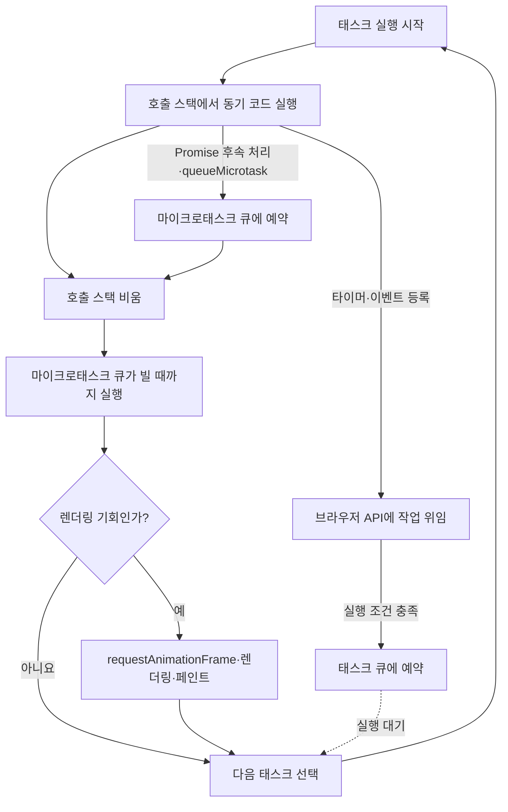
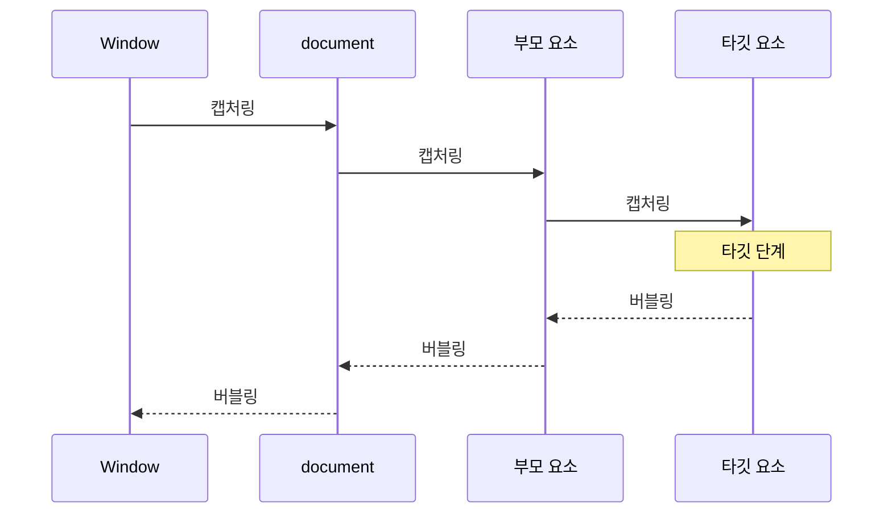

# 3장. 자바스크립트 핵심 개념

## Q43. 실행 컨텍스트를 들어 본 적 있나요?

### 면접 답변

실행 컨텍스트는 자바스크립트 엔진이 현재 실행 중인 코드의 상태를 추적하기 위해 사용하는 개념입니다. 자바스크립트 코드가 실행되면 먼저 전역 실행 컨텍스트가 만들어지고, 함수가 호출될 때마다 해당 함수를 위한 실행 컨텍스트가 새로 생성되어 실행 컨텍스트 스택에 쌓입니다. 가장 위에 있는 실행 컨텍스트가 현재 실행 중인 컨텍스트이며, 함수 실행이 끝나면 스택에서 제거됩니다.

실행 컨텍스트는 식별자를 검색하는 데 사용하는 렉시컬 환경, `var` 선언으로 만들어진 바인딩을 관리하는 변수 환경, 실행 중인 함수와 코드의 출처 같은 상태를 추적합니다. `this`는 현재 렉시컬 환경의 환경 레코드를 따라 결정되거나, 화살표 함수처럼 외부 환경의 값을 사용합니다. 이를 이해하면 호이스팅과 TDZ, 스코프 체인, 클로저, `this` 바인딩, 호출 스택의 동작을 하나의 흐름으로 설명할 수 있습니다.

### 핵심 개념

#### 실행 컨텍스트

- **실행 컨텍스트**: ECMAScript 구현체가 코드의 런타임 평가 상태를 추적하기 위해 사용하는 명세상의 장치
- **현재 실행 컨텍스트**: 실행 컨텍스트 스택의 최상단에 위치하여 실제로 코드를 평가 중인 컨텍스트
- **생성 시점**: 스크립트나 모듈 평가 시작, 함수 호출, `eval` 실행 등 새로운 코드 평가로 제어가 이동할 때 생성
- **제거 시점**: 해당 코드의 실행이 완료되고 이전 실행 컨텍스트로 제어가 돌아갈 때 스택에서 제거
- **직접 접근 불가**: 자바스크립트 코드에서 실행 컨텍스트 자체를 객체처럼 조회하거나 조작할 수 없는 내부 개념

> 실행 컨텍스트를 흔히 “코드 실행에 필요한 정보를 담은 객체”라고 설명하지만, 실제 자바스크립트 객체가 아니라 엔진의 동작을 설명하기 위한 명세상의 개념

#### 실행 컨텍스트의 종류


| 종류                 | 생성 시점                   | 주요 역할                            |
| ------------------ | ----------------------- | -------------------------------- |
| **스크립트 실행 컨텍스트**   | 일반 스크립트 평가 시작           | 전역 선언과 전역 코드를 평가하는 상태 관리         |
| **모듈 실행 컨텍스트**     | ES 모듈 평가 시작             | 모듈 스코프와 `import`·`export` 바인딩 관리 |
| **함수 실행 컨텍스트**     | 함수가 호출될 때마다             | 매개변수, 지역 선언, 실행 위치와 함수 호출 상태 관리  |
| **`eval` 실행 컨텍스트** | `eval()`로 문자열 코드를 평가할 때 | `eval` 코드의 평가 상태 관리              |


- **호출마다 독립적인 컨텍스트**: 같은 함수도 호출될 때마다 별도의 함수 실행 컨텍스트 생성
- **재귀 호출**: 동일한 함수의 실행 컨텍스트가 호출 횟수만큼 스택에 쌓이는 구조
- **모듈의 특징**: 자체 스코프를 가지며 항상 엄격 모드로 실행

#### 실행 컨텍스트가 추적하는 주요 상태

- **코드 평가 상태**: 코드의 실행, 일시 중단, 재개에 필요한 현재 위치와 상태
- **`Function`**: 함수 코드를 평가 중인 경우 현재 실행 중인 함수 객체
- **`Realm`**: 코드가 사용하는 전역 객체와 내장 객체가 속한 실행 영역
- **`ScriptOrModule`**: 현재 코드가 시작된 스크립트 또는 모듈 정보
- **`LexicalEnvironment`**: 현재 코드에서 식별자 참조를 해석할 환경 레코드
- **`VariableEnvironment`**: 현재 컨텍스트의 `var` 선언으로 생성된 바인딩을 관리하는 환경 레코드
- **`PrivateEnvironment`**: 가장 가까운 클래스의 private 이름을 해석하는 환경 레코드

#### 렉시컬 환경

- **렉시컬 환경**: 코드가 작성된 위치를 기준으로 식별자와 값을 연결하고 외부 스코프와의 관계를 나타내는 구조
- **환경 레코드**: 현재 스코프의 변수, 함수, 매개변수 등 식별자 바인딩을 기록하는 명세상의 구조
- **외부 렉시컬 환경 참조**: 현재 환경에서 식별자를 찾지 못했을 때 탐색할 상위 렉시컬 환경
- **렉시컬 스코프**: 함수가 호출된 위치가 아니라 소스 코드에서 선언된 위치를 기준으로 결정되는 스코프
- **스코프 체인**: 현재 렉시컬 환경부터 외부 렉시컬 환경 참조를 연속해서 따라가는 식별자 탐색 경로
- **탐색 종료**: 가장 바깥쪽 환경까지 식별자를 찾지 못하면 `ReferenceError` 발생

```javascript
const globalValue = "전역";

function outer() {
  const outerValue = "외부 함수";

  function inner() {
    const innerValue = "내부 함수";
    console.log(globalValue, outerValue, innerValue);
  }

  inner();
}

outer();
```

`inner`에서 식별자를 찾는 순서는 다음과 같습니다.

```text
inner 렉시컬 환경
  → outer 렉시컬 환경
    → 전역 렉시컬 환경
```

- `innerValue`: `inner`의 환경 레코드에서 탐색
- `outerValue`: 외부 참조를 따라 `outer`의 환경 레코드에서 탐색
- `globalValue`: 다시 외부 참조를 따라 전역 환경 레코드에서 탐색

#### 렉시컬 환경과 변수 환경


| 구분         | 역할                                |
| ---------- | --------------------------------- |
| **렉시컬 환경** | 현재 코드의 식별자 참조를 해석하는 데 사용          |
| **변수 환경**  | 현재 컨텍스트에서 `var` 선언으로 만들어지는 바인딩 관리 |


- **함수 실행 시작 시점**: 대부분 동일한 환경 레코드를 가리키는 렉시컬 환경과 변수 환경
- **블록 진입**: `let`, `const`, `class`를 위한 새로운 렉시컬 환경 생성 가능
- **`var`의 함수 스코프**: 블록 안에서 선언해도 해당 함수의 변수 환경에 바인딩
- **`let`·`const`의 블록 스코프**: 블록마다 만들어진 렉시컬 환경에 바인딩

```javascript
function example() {
  if (true) {
    var functionScoped = "함수 스코프";
    let blockScoped = "블록 스코프";
  }

  console.log(functionScoped); // "함수 스코프"
  console.log(blockScoped); // ReferenceError
}
```

#### 생성 준비와 코드 평가

실행 컨텍스트를 설명할 때 흔히 **생성 단계**와 **실행 단계**로 나누지만, 이는 학습을 위한 표현입니다. 명세에서는 선언을 환경 레코드에 등록하는 **선언 인스턴스화** 과정과 실제 구문을 평가하는 과정을 세부 알고리즘으로 정의합니다.


| 선언            | 코드 평가 전 준비 상태      | 선언문 평가 이후    |
| ------------- | ------------------ | ------------ |
| 함수 선언문        | 함수 객체로 초기화         | 선언 전에도 호출 가능 |
| `var`         | `undefined`로 초기화   | 할당문에서 값 변경   |
| `let`·`const` | 바인딩만 생성되고 초기화되지 않음 | 선언문 평가 시 초기화 |


- **호이스팅**: 선언을 물리적으로 코드 위로 이동하는 동작이 아니라 코드 평가 전에 바인딩을 준비하는 과정에서 나타나는 현상
- **TDZ**: `let`, `const`, `class` 바인딩이 생성된 후 초기화되기 전까지 접근할 수 없는 구간
- **함수 선언문**: 선언 인스턴스화 과정에서 함수 객체까지 초기화되므로 선언문보다 앞에서 호출 가능

```javascript
console.log(varValue); // undefined
// console.log(letValue); // ReferenceError
sayHello(); // "hello"

var varValue = 1;
let letValue = 2;

function sayHello() {
  console.log("hello");
}
```

#### 실행 컨텍스트 스택과 호출 스택

실행 컨텍스트는 스택 구조로 관리됩니다. 일반적으로 이를 **실행 컨텍스트 스택** 또는 **호출 스택**이라고 부릅니다.

```javascript
function one() {
  two();
}

function two() {
  three();
}

function three() {
  console.log("실행");
}

one();
```

```text
1. [전역]
2. [전역, one]
3. [전역, one, two]
4. [전역, one, two, three]
5. [전역, one, two]
6. [전역, one]
7. [전역]
```

- **후입선출**: 마지막에 호출된 함수가 가장 먼저 실행을 마치고 제거되는 LIFO 구조
- **실행 순서 관리**: 스택 최상단의 실행 컨텍스트가 현재 실행 중인 코드
- **스택 오버플로**: 종료 조건 없는 재귀 호출처럼 컨텍스트가 계속 쌓여 스택의 한도를 초과한 상태

#### 호출 스택과 스코프 체인의 차이


| 구분    | 호출 스택            | 스코프 체인                |
| ----- | ---------------- | --------------------- |
| 결정 기준 | 함수가 실제로 호출된 순서   | 함수와 블록이 소스 코드에 선언된 위치 |
| 주요 역할 | 실행 순서와 복귀 위치 관리  | 식별자 탐색 경로 제공          |
| 변화 시점 | 함수 호출과 종료        | 렉시컬 환경 생성과 연결         |
| 구조    | 실행 컨텍스트의 LIFO 스택 | 외부 렉시컬 환경 참조의 연결      |


- **호출 스택의 질문**: 지금 어떤 함수가 실행 중이며 끝난 뒤 어디로 돌아가는가?
- **스코프 체인의 질문**: 현재 코드에서 이 식별자의 값을 어디에서 찾는가?
- **독립적인 기준**: 어떤 함수가 다른 함수에서 호출되더라도 변수 탐색 경로는 호출자가 아니라 선언 위치를 기준으로 결정

#### `this` 바인딩

- **일반 함수**: 함수가 선언된 위치가 아니라 호출된 방식에 따라 `this` 결정
- **메서드 호출**: `object.method()`에서 `this`는 일반적으로 점 앞의 `object`
- **단독 함수 호출**: 일반 스크립트의 비엄격 모드에서는 `globalThis`, 엄격 모드에서는 `undefined`
- **명시적 바인딩**: `call()`, `apply()`, `bind()`를 사용해 `this` 지정 가능
- **생성자 호출**: `new`로 생성된 새 객체에 `this` 바인딩
- **화살표 함수**: 자신만의 `this` 바인딩을 만들지 않고 외부 렉시컬 환경의 `this` 사용
- **ES 모듈 최상위 `this`**: `undefined`
- **이식 가능한 전역 객체 접근**: 브라우저의 `window`나 Node.js의 `global` 대신 `globalThis` 사용

```javascript
"use strict";

function regular() {
  console.log(this);
}

const object = {
  method: regular,
  arrow: () => console.log(this),
};

regular(); // undefined
object.method(); // object
object.arrow(); // 외부 렉시컬 환경의 this
```

> 최신 ECMAScript 명세에서 `this` 바인딩은 실행 컨텍스트의 단순한 프로퍼티라기보다 환경 레코드를 통해 해석되는 값으로 설명

> 참고: [ECMAScript 명세 - Execution Contexts](https://tc39.es/ecma262/#sec-execution-contexts), [ECMAScript 명세 - Environment Records](https://tc39.es/ecma262/#sec-environment-records), [MDN - 클로저](https://developer.mozilla.org/ko/docs/Web/JavaScript/Guide/Closures), [MDN - `this`](https://developer.mozilla.org/ko/docs/Web/JavaScript/Reference/Operators/this)

### 모의 면접

**1. 실행 컨텍스트가 생성될 때 자바스크립트 엔진은 어떤 정보들을 준비하며 이 과정이 중요한 이유는 무엇인가요?**

자바스크립트 엔진은 식별자를 해석하기 위한 렉시컬 환경, `var` 선언의 바인딩을 관리하는 변수 환경, 현재 실행할 함수와 코드의 출처 같은 상태를 준비합니다. 함수 환경 레코드는 호출 방식에 따라 `this` 바인딩을 결정하는 데 필요한 정보도 관리합니다.

이 과정에서 변수와 함수 선언을 환경 레코드에 등록하므로 호이스팅과 TDZ의 동작이 결정됩니다. 또한 외부 렉시컬 환경 참조가 연결되어 실행 중에 식별자를 어느 스코프에서 찾아야 하는지도 결정됩니다. 따라서 실행 컨텍스트는 코드의 실행 순서, 변수 탐색, `this` 해석을 일관되게 관리하는 기반이 됩니다.

**2. 스코프 체인과 호출 스택은 각각 어떤 역할을 하며 실행 컨텍스트와 어떻게 연관되어 있나요?**

호출 스택은 함수가 호출된 순서대로 실행 컨텍스트를 쌓아 현재 실행할 코드와 함수가 끝난 뒤 돌아갈 위치를 관리합니다. 함수 호출이 끝나면 해당 실행 컨텍스트가 스택에서 제거되고 이전 컨텍스트의 실행이 이어집니다.

스코프 체인은 실행 컨텍스트의 렉시컬 환경과 외부 렉시컬 환경 참조가 연결된 구조로, 변수나 함수를 어느 스코프에서 찾을지 결정합니다. 호출 스택은 동적인 함수 호출 순서를 따르지만 스코프 체인은 코드가 선언된 렉시컬 구조를 따릅니다. 따라서 두 구조는 각각 실행 순서와 식별자 탐색을 담당하면서 실행 컨텍스트를 중심으로 함께 동작합니다.

## Q46. 자바스크립트의 이벤트 루프와 태스크 큐란 무엇인가요?

### 면접 답변

자바스크립트 엔진은 한 에이전트에서 한 번에 하나의 작업을 호출 스택에서 실행합니다. 타이머나 네트워크 요청처럼 기다림이 필요한 작업은 브라우저가 제공하는 API에 위임하고, 실행할 수 있게 된 콜백은 태스크 큐나 마이크로태스크 큐에 예약합니다. 이벤트 루프는 호출 스택이 비었을 때 이러한 작업을 정해진 순서에 따라 실행할 수 있도록 조정합니다.

브라우저 이벤트 루프는 일반적으로 태스크 하나를 끝까지 실행한 뒤 마이크로태스크 큐가 빌 때까지 모든 마이크로태스크를 처리하고, 필요한 경우 렌더링할 기회를 가집니다. `setTimeout` 콜백과 사용자 이벤트 콜백은 태스크로, Promise 후속 처리와 `queueMicrotask()` 콜백은 마이크로태스크로 실행됩니다. 이 구조 덕분에 자바스크립트는 메인 스레드에서 코드를 순차적으로 실행하면서도 오래 기다리는 작업 때문에 전체 실행을 멈추지 않고 비동기 작업을 처리할 수 있습니다.

### 핵심 개념

#### 자바스크립트 엔진과 호스트 환경

- **자바스크립트 엔진**: ECMAScript 언어를 해석하고 호출 스택에서 코드를 실행하는 주체
- **호스트 환경**: DOM, 타이머, 네트워크 요청, 이벤트 처리 등 ECMAScript 외부 기능을 제공하는 실행 환경
- **브라우저 API**: 브라우저가 제공하는 호스트 API를 학습 과정에서 통칭하는 표현
- **메인 스레드**: 자바스크립트 실행, 사용자 이벤트 처리, 스타일 계산과 렌더링 등이 주로 함께 이루어지는 스레드
- **싱글 스레드 실행**: 하나의 자바스크립트 에이전트가 한 시점에 하나의 실행 흐름을 처리하는 특성
- **Run-to-completion**: 한 작업의 자바스크립트 실행이 시작되면 호출 스택이 빌 때까지 다른 작업이 중간에 끼어들지 않는 실행 방식
- **동시성**: 여러 작업의 대기와 실행을 번갈아 조정하여 동시에 진행되는 것처럼 처리하는 구조
- **병렬성**: 여러 작업을 실제로 같은 시점에 실행하는 구조로, Web Worker처럼 별도의 에이전트를 사용할 때 가능

> `setTimeout`, DOM 이벤트, `fetch` 등은 자바스크립트 언어 자체가 아니라 브라우저와 같은 호스트 환경에서 제공하는 기능

#### 이벤트 루프를 구성하는 요소


| 구성 요소         | 역할                                   |
| ------------- | ------------------------------------ |
| **호출 스택**     | 현재 실행 중인 함수와 실행 컨텍스트 관리              |
| **힙**         | 객체가 저장되는 메모리 영역                      |
| **호스트 API**   | 타이머, 네트워크 요청, DOM 이벤트 등 비동기 작업 처리    |
| **태스크 큐**     | 실행 가능한 태스크의 대기열                      |
| **마이크로태스크 큐** | 현재 태스크 직후 처리할 마이크로태스크의 대기열           |
| **이벤트 루프**    | 실행할 태스크 선택, 마이크로태스크 체크포인트, 렌더링 기회 조정 |




#### 태스크 큐

- **태스크**: 이벤트 루프가 선택하여 실행하는 독립적인 작업 단위
- **일반적인 사례**: 최초 스크립트 실행, 사용자 이벤트 콜백, `setTimeout`, `setInterval`, `MessageChannel`
- **실행 단위**: 이벤트 루프의 한 반복에서 최대 하나의 태스크를 선택하여 끝까지 실행
- **FIFO 성격**: 같은 태스크 큐에서는 먼저 들어온 실행 가능한 태스크를 먼저 처리
- **복수 태스크 큐**: HTML 표준에서는 하나의 큐만 두는 것이 아니라 태스크 소스와 우선순위를 고려할 수 있는 여러 태스크 큐를 허용
- **매크로태스크**: 태스크와 마이크로태스크를 구분하기 위해 실무에서 사용하는 비공식 표현으로, HTML 표준의 정식 용어는 **태스크**

#### 마이크로태스크 큐

- **마이크로태스크**: 현재 작업이 끝난 직후 다음 태스크보다 먼저 실행할 짧은 작업
- **일반적인 사례**: Promise의 `then()`·`catch()`·`finally()` 콜백, `queueMicrotask()`, `MutationObserver` 콜백
- **실행 시점**: 자바스크립트 실행 스택이 비고 마이크로태스크 체크포인트가 수행될 때
- **전체 소진**: 체크포인트가 시작되면 큐가 빌 때까지 모든 마이크로태스크 처리
- **연쇄 등록**: 마이크로태스크가 실행 중에 새 마이크로태스크를 추가하면 다음 태스크 전에 이어서 처리
- **높은 우선순위의 의미**: 현재 실행 중인 코드를 중단하는 것이 아니라 현재 태스크가 끝난 뒤 다음 태스크보다 먼저 실행
- **기아 상태 위험**: 마이크로태스크가 계속 자신을 추가하면 다음 태스크와 렌더링이 오랫동안 실행되지 못하는 현상

#### 태스크와 마이크로태스크 비교


| 구분           | 태스크                        | 마이크로태스크                           |
| ------------ | -------------------------- | --------------------------------- |
| 대표 사례        | 스크립트, 클릭 이벤트, `setTimeout` | Promise 후속 처리, `queueMicrotask()` |
| 처리 시점        | 이벤트 루프가 실행 가능한 태스크 하나를 선택  | 현재 태스크가 끝난 뒤 체크포인트에서 실행           |
| 한 번에 처리하는 범위 | 선택한 태스크 하나                 | 큐가 빌 때까지 전부                       |
| 새 작업이 추가된 경우 | 이후 이벤트 루프 반복에서 실행          | 같은 체크포인트에서 이어서 실행 가능              |
| 렌더링과의 관계     | 태스크 종료 후 렌더링 기회 가능         | 모든 마이크로태스크가 끝나야 렌더링 기회 가능         |


#### 이벤트 루프의 한 번의 처리 흐름

브라우저의 이벤트 루프를 학습 목적으로 단순화하면 다음과 같습니다.

```text
1. 실행 가능한 태스크 하나 선택
2. 선택한 태스크를 호출 스택에서 끝까지 실행
3. 마이크로태스크 체크포인트 수행
4. 마이크로태스크 큐가 빌 때까지 실행
5. 렌더링 기회라면 애니메이션 콜백과 화면 갱신 처리
6. 다음 반복에서 새로운 태스크 선택
```

- **태스크 선택**: 브라우저는 여러 태스크 큐 중 실행할 태스크를 선택 가능
- **마이크로태스크 체크포인트**: Promise 후속 처리처럼 현재 작업에 이어져야 하는 작업을 모두 처리
- **렌더링 기회**: 매 반복마다 반드시 렌더링하는 것이 아니라 화면 갱신이 필요한 시점에 브라우저가 판단
- **다음 반복**: 렌더링 여부와 관계없이 이후 실행 가능한 태스크 처리

#### 실행 순서 예제

```javascript
console.log("Script Start");

setTimeout(() => {
  console.log("setTimeout Callback");
}, 0);

Promise.resolve().then(() => {
  console.log("Promise resolved");
});

console.log("Script End");
```

```text
Script Start
Script End
Promise resolved
setTimeout Callback
```

실행 과정은 다음과 같습니다.

1. 최초 스크립트가 하나의 태스크로 실행
2. `Script Start` 출력
3. `setTimeout`이 타이머 처리를 브라우저에 요청
4. Promise의 `then()` 콜백이 마이크로태스크 큐에 예약
5. `Script End` 출력 후 최초 스크립트 태스크 종료
6. 마이크로태스크 큐의 Promise 콜백 실행
7. 이후 이벤트 루프 반복에서 타이머 콜백 태스크 실행

#### `setTimeout(fn, 0)`의 의미

- **즉시 실행 아님**: 지정한 지연 시간은 콜백을 실행하는 정확한 시간이 아니라 태스크로 예약할 수 있는 최소 대기 시간
- **호출 스택 우선**: 현재 실행 중인 동기 코드와 호출 스택이 모두 끝난 뒤 실행 가능
- **마이크로태스크 우선**: 실행 시점에 앞서 처리해야 할 마이크로태스크가 있다면 모두 처리된 뒤 실행
- **브라우저 스케줄링 영향**: 다른 태스크, 탭의 상태, 타이머 중첩 제한 등에 따라 실제 실행 시점이 더 늦어질 수 있음
- **실행 양보**: 긴 작업을 여러 태스크로 나누어 브라우저가 사용자 입력과 렌더링을 처리할 기회를 제공할 때 활용 가능

#### 렌더링과 `requestAnimationFrame`

- **렌더링의 위치**: 태스크 큐에 들어가는 일반 태스크가 아니라 이벤트 루프가 렌더링 기회에 수행하는 별도의 처리 단계
- **`requestAnimationFrame`**: 다음 화면 갱신 전에 실행할 애니메이션 콜백 예약
- **실행 목적**: 화면 주사율과 브라우저의 렌더링 일정에 맞춘 시각적 업데이트
- **마이크로태스크와의 관계**: 마이크로태스크 큐가 비워진 뒤 렌더링 기회가 와야 콜백 실행 가능
- **백그라운드 최적화**: 보이지 않는 탭 등에서는 브라우저가 호출 빈도를 낮추거나 일시 중지 가능

```javascript
requestAnimationFrame(() => {
  element.style.transform = "translateX(100px)";
});
```

#### 긴 작업과 UI 블로킹

- **긴 태스크**: 메인 스레드를 오래 점유하여 사용자 입력과 렌더링을 지연시키는 작업
- **Run-to-completion의 영향**: 현재 태스크가 끝나기 전까지 이벤트 루프가 다른 태스크나 렌더링을 처리할 수 없는 구조
- **사용자 경험 문제**: 클릭 반응 지연, 스크롤 끊김, 애니메이션 프레임 누락
- **작업 분할**: 대량 연산을 여러 개의 짧은 태스크로 나누어 중간에 제어권을 브라우저에 반환
- **Web Worker**: UI와 직접 관련 없는 무거운 CPU 연산을 별도의 스레드에서 처리하는 방법

```javascript
function processInChunks(data, startIndex = 0) {
  const endIndex = Math.min(startIndex + 1000, data.length);

  for (let index = startIndex; index < endIndex; index += 1) {
    processItem(data[index]);
  }

  if (endIndex < data.length) {
    setTimeout(() => processInChunks(data, endIndex), 0);
  }
}
```

- 한 번에 최대 1,000개 항목만 처리한 뒤 다음 작업을 태스크로 예약
- 각 태스크 사이에 사용자 이벤트와 렌더링을 처리할 기회 제공
- 청크 크기가 지나치게 크면 여전히 UI 블로킹 발생 가능
- 짧은 계산을 무조건 잘게 나누면 스케줄링 비용이 증가할 수 있으므로 실제 측정에 따른 조정 필요

#### 마이크로태스크로 작업을 분할하면 안 되는 이유

```javascript
function repeat() {
  queueMicrotask(repeat);
}

repeat();
```

- 마이크로태스크가 실행될 때마다 새로운 마이크로태스크 추가
- 큐가 빌 때까지 처리한다는 규칙 때문에 다음 태스크로 이동 불가
- 사용자 이벤트, 타이머 콜백과 렌더링이 계속 지연될 수 있는 구조
- UI에 실행 기회를 돌려주려는 작업 분할에는 마이크로태스크보다 별도의 태스크나 적절한 스케줄링 API 사용

#### 브라우저와 Node.js 이벤트 루프의 차이

- **브라우저 이벤트 루프**: WHATWG HTML 표준의 태스크, 마이크로태스크, 렌더링 처리 모델
- **Node.js 이벤트 루프**: libuv 기반의 타이머, poll, check 등 여러 단계로 구성된 서버 런타임 모델
- **공통 개념**: 동기 코드 완료 후 예약된 비동기 콜백 처리
- **주의점**: 브라우저에서 관찰한 타이머와 마이크로태스크 순서를 Node.js의 모든 상황에 그대로 적용하기 어려움

> 참고: [WHATWG HTML - Event loops](https://html.spec.whatwg.org/multipage/webappapis.html#event-loops), [MDN - JavaScript execution model](https://developer.mozilla.org/en-US/docs/Web/JavaScript/Reference/Execution_model), [MDN - Tasks and microtasks](https://developer.mozilla.org/ko/docs/Web/API/HTML_DOM_API/Microtask_guide), [MDN - `requestAnimationFrame()`](https://developer.mozilla.org/ko/docs/Web/API/Window/requestAnimationFrame), [MDN - `setTimeout()`](https://developer.mozilla.org/ko/docs/Web/API/Window/setTimeout)

### 모의 면접

**1. 자바스크립트의 이벤트 루프는 호출 스택과 태스크 큐를 어떻게 연결하여 비동기 작업을 처리하나요?**

동기 코드는 호출 스택에서 순서대로 실행되고, 타이머나 네트워크 요청 같은 비동기 작업은 브라우저가 제공하는 API에 위임됩니다. 비동기 작업의 후속 콜백은 실행 조건이 충족되면 태스크 큐 또는 마이크로태스크 큐에 예약됩니다.

이벤트 루프는 실행 가능한 태스크 하나를 선택하여 호출 스택에서 끝까지 실행하도록 하고, 태스크가 끝나 호출 스택이 비면 마이크로태스크 큐를 모두 처리합니다. 그 뒤 브라우저는 필요한 경우 렌더링을 수행하고 다음 태스크를 선택합니다. 이 과정을 반복하여 메인 스레드의 실행 순서를 유지하면서 비동기 작업의 결과를 처리합니다.

**2. 마이크로 태스크 큐와 매크로 태스크 큐의 실행 우선순위 차이는 무엇이며 코드 실행 순서에 어떤 영향을 미치나요?**

태스크는 이벤트 루프의 반복마다 하나씩 선택되어 실행되지만, 마이크로태스크는 현재 태스크가 끝난 직후 다음 태스크보다 먼저 실행되며 큐가 빌 때까지 모두 처리됩니다. 따라서 `setTimeout` 콜백이 먼저 예약되었더라도 같은 태스크에서 Promise의 `then()` 콜백이 예약되면 Promise 콜백이 먼저 실행됩니다.

다만 마이크로태스크의 우선순위가 높다는 말은 실행 중인 동기 코드를 중단한다는 의미가 아닙니다. 현재 태스크가 끝나야 마이크로태스크가 실행되며, 마이크로태스크가 계속 새 마이크로태스크를 추가하면 다음 태스크와 화면 렌더링이 지연될 수 있습니다. 또한 매크로태스크는 표준의 정식 용어가 아니라 마이크로태스크와 구분하기 위해 흔히 사용하는 표현이며, HTML 표준에서는 태스크라고 부릅니다.

## Q49. 이벤트 전파나 위임이란 무엇인가요?

### 면접 답변

이벤트 전파는 DOM 요소에서 이벤트가 발생했을 때 이벤트 경로를 따라 이동하는 과정입니다. 이벤트는 최상위 객체에서 타깃 요소를 향해 내려가는 캡처링 단계, 이벤트가 실제 발생한 요소에 도달하는 타깃 단계, 다시 조상 요소를 향해 올라가는 버블링 단계를 거칩니다. 대부분의 이벤트 리스너는 기본적으로 버블링 단계에서 실행되며, `addEventListener`의 `capture` 옵션을 사용하면 캡처링 과정에서 실행할 수 있습니다.

이벤트 위임은 이러한 전파, 주로 버블링을 이용하여 여러 하위 요소의 이벤트를 공통 조상 요소의 리스너 하나로 처리하는 기법입니다. 이벤트가 발생한 요소는 `event.target`으로 확인하고, `closest()`와 `contains()` 등으로 처리할 대상을 검증합니다. 이 방식은 반복적인 리스너 등록을 줄이고, 리스너를 등록한 뒤 동적으로 추가된 하위 요소의 이벤트도 같은 조상에서 처리할 수 있어 동적인 목록 UI에 유용합니다.

다만 모든 이벤트가 버블링되는 것은 아니며, 이벤트 위임을 사용하면 타깃을 판별하는 로직이 복잡해질 수 있습니다. 따라서 이벤트의 `bubbles` 특성과 DOM 구조를 확인하고, 필요한 범위의 조상에만 위임해야 합니다.

### 핵심 개념

#### 이벤트 전파

- **이벤트 경로(event path)**: 이벤트가 전달되는 `Window`부터 타깃 요소까지의 객체 경로
- **전파 방향**: 최상위 객체에서 타깃으로 내려간 뒤, 버블링 가능한 이벤트라면 타깃에서 조상 방향으로 이동
- **리스너 실행 기준**: 리스너를 등록한 노드, 이벤트 단계, `capture` 옵션에 따라 결정
- **기본 동작과의 구분**: 링크 이동이나 폼 제출 같은 기본 동작은 이벤트 전파와 별개의 개념




| 단계  | `event.eventPhase` | 이동 방향      | 특징                              |
| --- | ------------------: | ---------- | ------------------------------- |
| 캡처링 | `1`                | 상위 객체 → 타깃 | `capture: true`인 조상 리스너 실행      |
| 타깃  | `2`                | 이벤트 타깃     | 타깃에 등록된 리스너 실행                  |
| 버블링 | `3`                | 타깃 → 상위 객체 | `bubbles`가 `true`인 경우 조상 리스너 실행 |


- 타깃 요소에서 실행되는 리스너의 `eventPhase` 값은 캡처링 리스너라도 `AT_TARGET(2)`
- 같은 타깃에서는 캡처링용으로 등록한 리스너가 일반 리스너보다 먼저 실행
- 이벤트 객체의 `bubbles` 속성으로 해당 이벤트의 버블링 가능 여부 확인
- `event.composedPath()`로 현재 이벤트가 거친 전파 경로 확인 가능

#### 캡처링 리스너 등록

```javascript
const parent = document.querySelector("#parent");

parent.addEventListener(
  "click",
  (event) => {
    console.log("캡처링 단계", event.eventPhase);
  },
  { capture: true },
);

parent.addEventListener("click", (event) => {
  console.log("버블링 단계", event.eventPhase);
});
```

- **기본값**: `capture: false`
- **캡처링 활용**: 버블링되지 않는 일부 이벤트 감지, 하위 요소보다 먼저 이벤트 관찰
- **등록과 제거**: 같은 이벤트 타입과 콜백이라도 `capture` 값이 다르면 별개의 리스너로 취급

#### `event.target`과 `event.currentTarget`


| 속성                    | 의미                   | 이벤트 위임에서의 역할             |
| --------------------- | -------------------- | ------------------------ |
| `event.target`        | 이벤트가 발생한 실제 타깃       | 어떤 하위 요소에서 이벤트가 시작됐는지 판별 |
| `event.currentTarget` | 현재 실행 중인 리스너가 등록된 요소 | 이벤트를 위임받아 처리하는 조상 요소 확인  |


```html
<ul id="menu">
  <li><button type="button">저장</button></li>
</ul>
```

```javascript
const menu = document.querySelector("#menu");

menu.addEventListener("click", (event) => {
  console.log(event.target); // 클릭한 button
  console.log(event.currentTarget); // 리스너가 등록된 ul
});
```

- 핸들러 바깥에서는 `event.currentTarget`이 `null`이 될 수 있으므로 필요한 값은 핸들러 안에서 사용
- Shadow DOM 경계를 지나는 이벤트에서는 캡슐화를 위해 `target`이 외부 요소로 재지정될 수 있음

#### 이벤트 위임

- **등록 위치**: 반복되는 하위 요소들을 포함하는 가까운 공통 조상
- **식별 방법**: `event.target`, `matches()`, `closest()`를 이용한 대상 탐색
- **범위 검증**: `closest()` 결과가 위임 컨테이너 내부에 속하는지 `contains()`로 확인
- **처리 방식**: 조건을 만족한 요소에만 로직 실행
- **주요 활용처**: 목록 항목, 테이블 행, 메뉴, 동적으로 추가·삭제되는 UI

```html
<ul id="comment-list">
  <li>
    댓글 1
    <button type="button" class="delete-button">삭제</button>
  </li>
  <li>
    댓글 2
    <button type="button" class="delete-button">삭제</button>
  </li>
</ul>

<button type="button" id="add-comment">댓글 추가</button>
```

```javascript
const commentList = document.querySelector("#comment-list");
const addCommentButton = document.querySelector("#add-comment");

commentList.addEventListener("click", (event) => {
  const deleteButton = event.target.closest(".delete-button");

  if (!deleteButton || !commentList.contains(deleteButton)) {
    return;
  }

  deleteButton.closest("li")?.remove();
});

addCommentButton.addEventListener("click", () => {
  const item = document.createElement("li");
  item.innerHTML = `
    새 댓글
    <button type="button" class="delete-button">삭제</button>
  `;
  commentList.append(item);
});
```

##### 동적으로 추가된 요소도 처리되는 이유

- 조상인 `commentList`에 등록된 리스너는 계속 유지
- 새 삭제 버튼에서 발생한 `click` 이벤트도 동일한 DOM 경로를 따라 버블링
- 버블링 과정에서 `commentList`에 도달한 이벤트를 기존 리스너가 처리
- 새 요소마다 별도의 리스너를 등록할 필요가 없는 구조

#### `matches()`, `closest()`, `contains()`의 역할

- **`matches(selector)`**: 타깃 요소 자체가 선택자와 일치하는지 검사
- **`closest(selector)`**: 타깃 자신부터 조상 방향으로 가장 가까운 일치 요소 탐색
- **`contains(node)`**: 찾은 요소가 위임 컨테이너의 범위 안에 포함되는지 검사
- 버튼 내부의 아이콘이나 텍스트를 클릭할 수 있는 UI에서는 `matches()`보다 `closest()`가 안정적인 경우가 많음

#### 이벤트 전파 제어와 기본 동작 취소


| 메서드                                | 효과                             | 주의점                               |
| ---------------------------------- | ------------------------------ | --------------------------------- |
| `event.stopPropagation()`          | 이후 다른 노드로 향하는 전파 중단            | 같은 노드에 등록된 다른 리스너는 계속 실행 가능       |
| `event.stopImmediatePropagation()` | 전파 중단과 함께 같은 노드의 이후 리스너 실행도 중단 | 다른 코드의 리스너까지 막을 수 있어 신중한 사용 필요    |
| `event.preventDefault()`           | 브라우저의 기본 동작 취소                 | 전파를 중단하지 않으며, 취소 가능한 이벤트에서만 효과 발생 |


```javascript
link.addEventListener("click", (event) => {
  event.preventDefault(); // 링크 이동 취소
  // 이벤트 전파는 계속됨
});
```

- `event.cancelable`이 `false`이면 `preventDefault()`로 취소 불가
- `{ passive: true }` 리스너에서는 `preventDefault()`를 사용할 수 없음
- 위임 경로 중간에서 `stopPropagation()`이 호출되면 상위 위임 리스너에 이벤트가 도달하지 않을 수 있음

#### 이벤트 위임이 바로 적용되지 않는 이벤트


| 이벤트                        | 버블링     | 위임 시 고려할 대안                           |
| -------------------------- | ------- | ------------------------------------- |
| `click`                    | O       | 일반적인 버블링 위임                           |
| `focus`, `blur`            | X       | 캡처링 리스너 또는 `focusin`, `focusout` 사용   |
| `focusin`, `focusout`      | O       | 포커스 이벤트 위임에 활용                        |
| `mouseenter`, `mouseleave` | X       | `mouseover`, `mouseout` 또는 포인터 이벤트 검토 |
| `mouseover`, `mouseout`    | O       | `relatedTarget`을 확인하여 내부 이동과 진입·이탈 구분 |
| `load`                     | 일반적으로 X | 대상 요소에 직접 등록                          |


- 이벤트 위임 가능 여부를 이벤트 이름만으로 추측하지 않고 `bubbles` 특성과 표준 동작 확인
- 버블링되지 않는 이벤트라도 캡처링 단계에서 관찰할 수 있는지는 이벤트 종류에 따라 별도 확인

#### Shadow DOM 경계와 이벤트 전파

- **`composed` 속성**: 이벤트가 Shadow DOM 경계를 넘어 전파될 수 있는지 표시
- **`target` 재지정(retargeting)**: Shadow DOM 내부 구현을 감추기 위해 외부 리스너에서 타깃이 호스트 요소로 보일 수 있는 동작
- **`composedPath()`**: 이벤트가 거친 객체 경로 확인. 닫힌 Shadow DOM의 접근할 수 없는 내부 노드는 경로에서 제외 가능
- **사용자 인터페이스 이벤트**: 대부분의 클릭 이벤트는 버블링되고 Shadow DOM 경계를 넘을 수 있음
- **사용자 정의 이벤트**: 외부 위임 리스너까지 전달하려면 의도에 따라 `bubbles`와 `composed` 옵션 설정

```javascript
component.dispatchEvent(
  new CustomEvent("item-select", {
    bubbles: true,
    composed: true,
    detail: { id: 1 },
  }),
);
```

#### 이벤트 위임의 장점과 주의점

**장점**

- 반복 요소마다 등록하던 리스너 수 감소
- 동적으로 추가되거나 제거되는 요소를 동일한 로직으로 처리
- 이벤트 처리 코드의 중앙화로 가독성과 유지보수성 향상
- 대량의 요소를 초기화할 때 반복적인 리스너 등록 비용 절감 가능

**주의점**

- 복잡한 DOM 구조에서 타깃 판별 조건 증가
- 너무 상위 요소에 위임할 경우 관련 없는 이벤트까지 필터링하는 비용 발생
- DOM 구조나 클래스명 변경에 위임 조건이 의존할 가능성
- 전파가 중간에 중단되거나 버블링되지 않는 이벤트에는 적용 제한
- 리스너 수 감소가 모든 상황에서 자동으로 더 높은 성능을 보장하는 것은 아니므로 실제 사용 패턴에 따른 판단 필요

> 참고: [WHATWG DOM - Events](https://dom.spec.whatwg.org/#events), [MDN - 이벤트 버블링](https://developer.mozilla.org/ko/docs/Learn_web_development/Core/Scripting/Event_bubbling), [MDN - `addEventListener()`](https://developer.mozilla.org/ko/docs/Web/API/EventTarget/addEventListener), [MDN - `Event.target`](https://developer.mozilla.org/ko/docs/Web/API/Event/target), [MDN - `Event.currentTarget`](https://developer.mozilla.org/en-US/docs/Web/API/Event/currentTarget), [MDN - `Event.composed`](https://developer.mozilla.org/en-US/docs/Web/API/Event/composed), [MDN - `focusin` 이벤트](https://developer.mozilla.org/en-US/docs/Web/API/Element/focusin_event), [MDN - `mouseenter` 이벤트](https://developer.mozilla.org/en-US/docs/Web/API/Element/mouseenter_event)

### 모의 면접

**1. 이벤트 전파의 3단계는 무엇이며 각 단계에서 이벤트가 어떻게 이동하는지 설명할 수 있나요?**

이벤트 전파는 캡처링, 타깃, 버블링의 세 단계로 이루어집니다. 캡처링 단계에서는 이벤트가 `Window`와 `document`를 비롯한 상위 객체에서 실제 타깃 요소를 향해 내려갑니다. 이때 `capture: true`로 등록한 조상 요소의 리스너가 실행됩니다.

타깃 단계에서는 이벤트가 실제로 발생한 요소에 도달하여 그 요소에 등록된 리스너가 실행됩니다. 이후 이벤트의 `bubbles` 속성이 `true`라면 버블링 단계로 넘어가 타깃의 부모에서 상위 객체 방향으로 올라가며 일반 리스너가 실행됩니다. 기본적인 `addEventListener`의 리스너는 `capture` 값이 `false`이므로 주로 버블링 단계에서 동작합니다.

**2. 이벤트 위임을 사용하면 동적으로 추가되는 요소의 이벤트를 별도로 등록하지 않아도 되는 이유는 무엇인가요?**

이벤트 위임에서는 동적으로 추가되는 하위 요소가 아니라 그 요소들을 감싸는 공통 조상에 이벤트 리스너를 등록합니다. 이후 새로 추가된 하위 요소에서 버블링 가능한 이벤트가 발생하면 그 이벤트도 기존 요소와 동일하게 DOM 경로를 따라 조상까지 전달됩니다.

따라서 조상의 리스너는 `event.target`이나 `closest()`를 통해 실제 이벤트가 발생한 하위 요소를 식별하여 처리할 수 있습니다. 새 요소가 만들어질 때마다 리스너를 다시 등록할 필요가 없고, 조상 리스너 하나가 현재와 미래의 하위 요소를 함께 처리할 수 있습니다.
