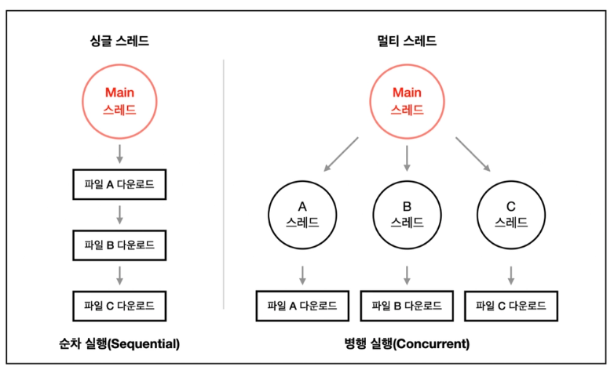

### Q43 실행 컨텍스트를 들어 본 적이 있나요?

#### **책을 읽기 전 혼자 답해보기**

> 실행 컨텍스트는 자바스크립트가 코드를 실행할 때 어떤 순서와 방식으로 실행하는지를 관리하는 개념으로 알고 있다.

#### 책정리

**실행 컨텍스트의 의미** 

실행 컨텍스트는 자바스크립트 코드가 실행되는데 필요한 모든 환경정보(변수, 함수, this 값 등)을 담고 있는 특별한 `객체`이다.

> 1. 변수와 함수 선언을 메모리에 올린다.  
> 2. this, 스코프 정보를 설정한다.

다양한 종류의 실행 컨텍스트가 있지만 주로 다루는 것은 아래 두 가지이다.

1. `전역 실행 컨텍스트`: 자바스크립트 코드가 실행되는 순간 가장 먼저 생성되는 `단 하나의 실행 컨텍스트`이다.
전역 스코프에 선언된 변수나 함수를 포함하며 `브라우저 환경에서는 window 객체`, `node.js에서는 global 객체`가 this로 바인딩된다.
2. `함수 실행 컨텍스트`: 함수가 호출될 때마다 `독립적으로 생성되는 실행 컨텍스트`이다. 함수 내부의 지역 변수, 매개변수, 중첩 함수 등의 정보를 담고있으며 함수 호출 방식에 따라 this 값이 동적으로 결정된다.

**실행 컨텍스트의 구성 요소**

`렉시컬 환경`: 현재 실행 중인 컨텍스트가 어떤 스코프에 놓여있는지 나타내는 구조
여기에는 코드 실행에 필요한 스코프 정보가 모두 모여있다.
렉시컬 환경은 `환경 레코드`와 `외부 렉시컬 환경 참조` 로 이루어져있다. 
**환경 레코드**는 현재 스코프 안에 선언된 변수, 함수, 매개변수와 같은 식별자들과 그에 대응하는 값을 저장한다.
**외부 렉시컬 환경**은 현재 스코프를 감싸고 있는 상위 스코프의 렉시컬 환경을 가르킨다. 이 참조를 통해 렉시켤 환경이 사슬처럼 연결되며 이걸 `스코프 체인`이라고 부른다. 

자바스크립트 엔진은 변수나 함수를 찾을 때 이 스코프 체인을 따라 상위 스코프로 이동하며 필요한 식별자를 검색한다. 

`변수 환경`: 렉시컬 환경과 거의 동일하지만 ES6 이전의 var 변수와 같은 초기화 방식의 차이 때문에 별도로 구분된다. 과거에는 `var로 선언된 변수가 호이스팅` 될 때 이 변수들이 별도의 공간인 변수 환경에 등록되었다.
즉, 변수 환경은 var 변수의 선언 정보를 관리하는 역할이었다. 선언 단계에서 식별자만 먼저 메모리에 올려두는 var 특유의 초기화 방식과 밀접하게 관련된 개념이다. 하지만 ES6 이후에 let, const가 도입되면서 현재는 렉시컬 환경의 한 부분이라고 생각해도 된다.

`this바인딩`: 현재 실행 컨텍스트 내에서 this 키워트가 참조할 객체를 결정한다. 자바스크립트에서의 this는 고정된 값이 아니라 함수가 어떤 방식으로 호출되었는지에 따라 그 대상이 동적으로 결정된다.

**실행 컨텍스트의 동작 방식**

자바스크립트 엔진은 이 실행 컨텍스트들을 `실행 컨텍스트 스택` 줄여서 콜스택이라는 특별한 자료구조에 쌓아 올리면서 코드를 실행한다. 

**`예제 코드`** 

```jsx
var b = 100;

function parent() {
  console.log(b); // 1

  var b = 200;

  function child() {
    b = 300;
    console.log(b); // 2
  }

  child();

  console.log(b); // 3
}

parent();
console.log(b); // 4

//실행결과
undefined
300
300
100

//동작설명
자바스크립트는 위에서 아래로 코드가 실행된다.

1. 가장 먼저 parent() 함수가 호출된다. parent() 함수 내부 첫 줄에 console.log(b)가 실행된다.
전역에 var b = 100;이 선언되어 있지만, 출력 결과는 undefined이다. 이유는 다음과 같다.
parent() 함수 내부에 var b = 200; 이라는 변수 선언이 존재한다.
자바스크립트 엔진은 함수가 실행될 때 함수 안에 있는 변수 선언을 먼저 최상단으로 끌어올린다(호이스팅).
자바스크립트 엔진이 인식하기에는 다음과 같다.

function parent() {
  var b;           // 호이스팅되어 선언만 먼저 됨 (undefined)
  console.log(b);  // 여기서 b는 선언만 된 상태라 undefined 출력
  b = 200;         // 여기서 200이 할당됨
  ...
}

이렇게 생각하면 이해가 쉽다.
parent() 내부에 b가 선언되어 있으므로 부모(전역) 스코프의 b = 100을 찾으러 가지 않고, 자신의 스코프에 있는 b(undefined)를 출력한다.

2. 그 다음 parent() 내부에서 child() 함수가 호출된다.
child() 함수 내부를 보면 var로 새로 선언된 b가 없다. 대신 `b = 300;`이라는 할당 코드가 있다.
child() 함수 내부에는 b라는 변수가 없기 때문에 부모 스코프인 parent() 함수로 올라가서 b를 찾는다.
parent()의 변수 b를 찾았고, 그 값을 200에서 300으로 바꿔버린다.
그리고 console.log(b)를 실행해 바뀐 값인 300이 출력된다.

3. child() 함수가 종료된 후, parent() 함수 내부의 마지막 console.log(b)가 실행된다.
방금 child() 함수가 부모 스코프인 parent()의 변수 b 값을 300으로 바꿔두었기 때문에 300이 출력된다.

4. 마지막으로 전역 스코프에서 호출된 console.log(b)를 보자.
parent()와 child()에서 복작복작 바꿨던 변수 b는 모두 parent() 함수 스코프 안에 갇혀있는 지역 변수였다.
따라서 전역에 있는 `var b = 100;`에는 아무런 영향을 주지 못했다.
그래서 전역 스코프의 console.log(b)는 그대로 100을 출력한다.
```

#### 모의 면접

Q1: 실행 컨텍스트가 생성될 때 자바스크립트 엔진은 어떤 정보들을 준비하며 이 과정이 중요한 이유는 무엇인가요?

> 자바스크립트 엔진은 실행 컨텍스트가 생성될 때 아래 두 가지 정보를 준비합니다.
> 
> 1. 변수와 함수 선언을 메모리에 올린다.
> 2. this, 스코프 정보를 설정한다.
> 
> 이 과정이 중요한 이유는 자바스크립트 엔진은 변수나 함수를 찾을 때 식별자를 통해 검색하며 렉시컬 환경 내의 외부 렉시컬 환경 참조를 통해 현재 스코프에 원하는 식별자가 없다면 상위 스코프로 올라가 식별자를 찾게됩니다. 이를 스코프 체인이라고 합니다.

Q2: 스코프 체인과 호출 스택은 각각 어떤 역할을 하며 실행 컨텍스트와 어떻게 연관되어 있나요?

> 스코프 체인은 자바스크립트 엔진이 변수, 함수 식별자를 찾을 때 굉장히 중요한 개념입니다. 
> 
> 실행 컨텍스트 가지고 있는 정보 중 렉시컬 환경에서 환경 레코드를 읽어서 현재 스코프에서 찾으려고 하는 식별자가 없을 경우 외부 렉시컬 환경 참조를 통해 현재 스코프의 상위 스코프로 올라가 식별자를 찾게 됩니다. 콜스택의 경우 자바스크립트가 코드 흐름을 관리하는 방법이며 먼저 호출 된 함수가 다른 함수를 호출하게 되고 FILO(선입후출) 자료구조로 이루어지게 된다. 그래서 마지막 함수 호출까지 종료되면 함수 실행 컨텍스트는 스택에서 제거되고 자바스크립트 코드 실행이 종료된다.

### Q46 자바스크립트의 이벤트 루프와 태스크 큐란 무엇인가요?

#### **책을 읽기 전 혼자 답해보기**

> 자바스크립트는 싱글스레드이기 때문에 한 번에 하나의 일 밖에 처리하지 못합니다. 그래서 이벤트 루프와 태스크 큐, 마이크로태스트큐를 사용하여 여러 개의 일을 동시에 처리하는 것처럼 보이게 할 수 있습니다. 
> 
> 이벤트 루프는 콜스택과 태스크큐를 감시하면서 태스크큐에 가장 오래된 작업을 스택에 올리고 그 일을 처리하게됩니다. 비동기 작업 즉 웹 API(setTimeout, setInterval)등을 수행할 때는 콜스택에 작업이 들어오자마자 웹 API를 호출하고 태스크큐에 등록만 해둡니다. 이후 이벤트 루프는 바로 다음 작업을 콜스택에 등록하여 작업하다가 기존 비동기 작업이 완료되면 해당 작업을 태스크큐에서 스택으로 옮긴 후 작업을 마무리합니다.

#### 책정리

### **싱글 스레드가 뭐에요?**

싱글은 하나, 스레드는 컴퓨터 프로세스 내에서 실행되는 작은 작업 단위를 말한다. 싱글 스레드는 이 두 개념을 합친 것으로 '한 번에 하나의 작업만 처리되는 환경'을 말한다.



### JavaScript 엔진

실행 공간은 **싱글 스레드**이며, 기본적으로 **동기(Synchronous) 코드**를 처리한다.

- 변수 선언 및 연산
- 함수 호출 및 실행
- 제어문(if, for 등)

### WebAPI(브라우저, Node.js)

자바스크립트 엔진이 아닌 실행환경이 제공하는 비동기 작업 처리용 API 모음, **여러 개의 스레드**로 동작하며 백그라운드에서 비동기 작업을 처리함

- **`setTimeout`**, **`setInterval`** 타이머
- DOM 이벤트 리스너(**`click`**, **`input`** 등)
- AJAX 요청(**`fetch`**, **`XMLHttpRequest`**)

---

### **태스크 큐 (Tasks Queue)**

- **`setTimeout`**, **`setInterval`**, DOM 이벤트 콜백, AJAX 콜백 등
- 큐에 먼저 들어간 순서대로 (FIFO) 콜백 실행

### **마이크로태스크 큐 (Microtask Queue)**

- **`Promise.then`**, **`MutationObserver`**, **`queueMicrotask`** 등
- 태스크 큐보다 우선 처리된다.

### 이벤트 루프

- 콜스택이 비어있는지 수시로 확인하며 큐에 쌓인 작업을 콜스택에 옮겨 실행하는 역할을 한다.
- 콜스택이 비어있다면 마이크로태스크 큐 작업부터 진행하며 이후 태스크 큐 작업을 실행한다.

---

### 콜스택

- 현재 어떤 함수가 동작 중인지, 다음에 어떤 함수가 호출 될 예정인지 등을 제어하는 자료구조
- FILO(First In Last Out) 처음에 들어간게 마지막에 나오는 구조이다.

```javascript
console.log("1");
setTimeout(() => {
  console.log("2");
}, 1000);
console.log("3");

// 실행결과
1
3
2
```

위 코드에서의 콜스택을 살펴보면 

1. 맨 처음 콜스택에 console.log(”1”)이 들어가 실행되어 1을 출력하고 콜스택에서 제거된다.
2. setTimeout 함수가 콜스택에 들어가 실행되며 webAPI로 넘어가 타이머가 작동되며 setTimeout 함수는 콜스택에서 제거된다. (2를 출력하지 않는다.)
3. console.log(”3”)이 콜스택에 들어가 실행되어 3을 출력하고 콜스택에서 제거된다. 
4. webAPI로부터 타이머가 종료된 후 콜백 함수인 console.log(”2”)가 태스크 큐에 옮겨진다.
5. 이벤트 루프는 수시로 콜스택과 큐 상태를 감시하며, 콜스택이 비어있음을 확인 후 테스크 큐에 쌓여진 작업 중 제일 첫 번째를 콜스택에 옮긴다.
6. console.log(”2”)가 출력되고 콜스택에서 제거된다. 

### 정리

> **자바스크립트는 싱글 스레드 언어인데 비동기 처리는 어떻게 가능한가요? 이벤트 루프, 콜 스택, 태스크 큐(Microtask 포함) 중심으로 설명해주세요.**
> 

자바스크립트는 싱글 스레드 언어로 하나의 콜스택을 가지고 있습니다. 

싱글 스레드라고 하면 하나의 작업만을 수행할 수 있는 상태이지만 자바스크립트는 마치 사용자가 보기에 멀티 스레드인 것처럼 보입니다. 그 이유는 이벤트 루프의 역할에 있는데요. 이벤트 루프는 수시로 콜스택을 확인하며 현재 작업이 가능한 상태인지 확인합니다. 작업이 가능하다면 먼저 마이크로태스크 큐를 확인하여 콜스택에 옮겨 실행하고 그 후 태스크 큐에 있는 작업을 옮겨 작업을 수행합니다. 비동기 코드가 콜스택에 들어간다면 webAPI에서 백그라운드 작업을 처리하게 되고 이때 명령만 하고 콜스택은 비워집니다. 비동기 코드의 수행이 끝난다면 등록 된 콜백함수가 해당 비동기 작업에 해당하는 큐로 옮겨지며(태스크 큐, 마이크로태스크큐)

이벤트 루프가 콜스택을 감시하고 있다가 큐에서 옮겨 작업을 실행하게됩니다. 이런 일련의 과정들을 통해 자바스크립트가 싱글 스레드 언어임에도 비동기 처리를 할 수 있는 것입니다.

### 태스크 큐와 마이크로 태스크 큐

태스크 큐에는 한 종류만 있는 것이 아니다. 마이크로 태스크 큐라는 `더 높은 우선순위`를 가진 큐가 존재한다.
일반적으로 태스크 큐라고 부르는 곳에서는 setTimeout, setInterval, setImmediate. I/O, UI 랜더링처럼 비교적 나중에 처리해도 되는 `매크로 태스크`를 처리한다. 반면 마이크로 태스크 큐는 프로미스의 .then(), .catch(), .finally(), queMicrotask, MutationObserver와 같이 비동기 작업이 끝난 직후 바로 처리되어야 하는 마이크 태스크를 작업한다. 
이벤트 루프는 동작 순서가 정해져있는데 콜스택이 비어있으면 먼저 매크로 태스크 하나를 처리한 후 마이크로 태스크 큐에 쌓여있는 작업을 모두 처리한다. 마이크로 태스크가 전부 비워진 다음 매크로 태스크를 처리하거나 렌더링을 수행한다. 

### 이벤트 루프를 이용한 UI 블로킹 방지

이벤트 루프의 원리를 이해하면 몇 가지 유용한 트릭을 사용할 수 있다. 그 중 대표적인 예시가 UI 블로킹 현상을 방지하는 방법이다. 데규모 데이터를 처리하는 무거운 작업이 있고 그걸 순회해야할 때 콜스택은 해당 작업이 끝날 때까지 비워지지 않는다. 이때 웹 API(해당 교재에서는 setTimeout)를 사용하여 작업을 분할하여 UI 랜더링을 방해하지 않을 수 있다.

#### 모의 면접

Q1: 자바스크립트의 이벤트 루프는 호출 스택과 태스크 큐를 어떻게 연결하여 비동기 작업을 처리하나요? 

> 이벤트 루프는 콜스택과 태스크 큐를 감시하는 역할을 한다. 동기 작업의 경우 순서대로 콜스택에서 작업이 이루어지며 비동기 작업의 경우 웹 API를 호출하고 이후 즉시 스택에서 제거된다. 비동기 작업이 종류 후 콜백 함수가 태스크 큐에 들어가게 되고 이벤트 루프가 현재 콜스택이 비어있는지 확인 후 콜스택에 올려서 작업을 처리하게된다.

Q2: 마이크로 태스크 큐와 매크로 태스크 큐의 실행 우선순위 차이는 무엇이며 코드 실행 순서에 어떤 영향을 미치나요? 

> 콜스택이 비어있을 경우 매크로 태스크 하나를 처리한 후 마이크로 태스트 큐에 쌓여있는 작업을 처리한다. 다음 매크로 태스크를 처리하거나 UI 렌더링을 수행한다. 해당 작업이 거치는 큐의 우선순위의 따라 결과가 달라진다.

### Q49 이벤트 전파나 위임이란 무엇인가요?

#### **책을 읽기 전 혼자 답해보기**

> 이벤트 전파란 보통 window, Dom, body, div, button 이런 순서로 레이어가 깔려있으며 각 레이어마다 이벤트가 등록되어있을 때 button 클릭시 그 이벤트가 상위로 올라가 해당 레이어의 이벤트를 모두 트리거하는 것을 이벤트 전파(버블링)라고 한다. 이벤트 위임이란 까먹었다..

#### 책정리

**이벤트 전파란?**

이벤트 전파는 돔 트리에서 이벤트가 발생했을 때 해당 이벤트가 돔 트리의 노드들을 따라 이동하는 방식을 의미한다. 이 과정은 크게 3단계로 나뉜다.

1. 이벤트 캡처링 단계
2. 이벤트 타깃 단계
3. 이벤트 버블링 단계

`이벤트 캡처링 단계`: 이벤트가 발생한 가장 최상위 부모 요소(일반적으로 window 또는 document)에서 시작하여 실제 이벤트가 발생한 타깃 요소가 돔 트리를 아래 방향으로 이동하는 과정이다. 
이 단계에서 특정 이벤트 리스너가 등록되어있다면 먼저 실행될 수 있다. 다만 캡처링 단계에서 이벤트를 감지하려면 addEventListener의 세 번째 인자가 `true`여야한다.

`이벤트 타깃 단계`: 이벤트가 실제로 발생한 요소, 즉 타깃 요소에 도달하는 단계이다. 
이 단계에서는 해당 요소에 등록된 이벤트 리스너가 실행된다.

`이벤트 버블링 단계`: 타깃 요소에서 이벤트가 처리된 후 다시 돔 트리를 따라 부모 요소 방향으로 이동하며 전파된다. `대부분의 이벤트는 기본적으로 이 버블링 단계에서 작동한다.`  addEventListener의 세 번째 인자를 생략하거나 false로 설정하면 이 단계에서 이벤트를 감지한다. 클릭, 키보드 입력 등 대부분의 이벤트는 버블링 되지만 focus, blur, scroll과 같은 일부 이벤트는 버블링 되지 않는다.

**이벤트 위임이란?**

이벤트 위임은 이벤트 전파 특히 버블링의 원리를 활용한 이벤트 처리기법이다.

여러 하위 요소에 각각 이벤트 리스너를 붙이는 대신, 이 요소를 감싸는 공통된 상위 요소에만 이벤트 리스너를 하나만 등록하고 실제 이벤트가 발생한 하위 요소를 식별하여 처리한다. 

이벤트 위임은 다음과 같은 순서로 구현한다.

1. 이벤트 리스너를 등록할 상위 요소를 선택한다.
2. 이벤트 리스너를 상위 요소에 하나만 등록한다.
3. 이벤트 랜들러 함수 내부에서 event.target속성을 사용하여 실제로 이벤트가 발생한 하위 요소를 확인한다.
4. event.target이 원하는 하위 요소인지 확인하고 해당 요소에 맞는 로직을 실행한다. 
필요에 따라 event.target.closest() 등의 메서드를 사용하여 특정 조상 요소를 찾는데 활용할 수 있다.

```html
<ul> // ul에 이벤트 리스너 등록
	<li/> 하위 <li> target으로 이벤트 전파
	<li/>
	<li/>
</ul> 
```

**이벤트 위임의 장점과 단점**

이벤트 위임을 사용하면 성능과 코드 구조 측면에서 여러가지 `장점`이 있다. 

- `성능최적화`: 많의 수의 요소에 개별적으로 이벤트 리스터를 등록하는 대신, 단 하나의 리스너만 등록하므로 메로리 사용량이 줄어들고 성능이 향상된다.
- `동적 요소 처리 용이`: 나중에 자바스크립트 돔에 추가되는 요소들에도 자동으로 이벤트 처리가 적용된다.
새로 추가될 때마다 리스너를 재등록할 필요가 없어 코드가 간결해진다.
- `코드 유지보수 용이`: 이벤트 처리 로직이 한 곳에 집중되므로 코드의 가독성이 높아지고 유지보수가 쉬워진다.
- `코드양 감소`: 반복적인 리스터 등록 코드가 사라져 전체 코드가 줄어든다.

하지만 `단점`도 존재한다.

- `event.target 검증의 복잡성`: 이벤트 핸들러 내부에서 event.target이 어떤 요소인지 정확히 확인하고 적절한 로직을 수행해야 하므로 조건문이 복잡해질 수 있다.
- `모든 이벤트가 버블링되는 것은 아님` : focus, blur, scroll, load, unload, resize 등 일부 이벤트는 버블링되지 않으므로 이러한 이벤트에는 이벤트 위임을 적용할 수 없다.

#### 모의 면접

Q1: 이벤트 전파의 3단계는 무엇이며 각 단계에서 이벤트가 어떻게 이동하는지 설명할 수 있나요?

> 이벤트 전파의 3단계로는 이벤트 캡처링, 이벤트 타겟 ,이벤트 버블링가 있다.
> 
> 이벤트 캡처링 단계에서는 이벤트가 발생한 가장 최상위 요소에서 실제 이벤트가 하위 요소로 이벤트가 이동한다.
> 
> 이벤트 타겟 단계에서는 이벤트가 실제로 발생한 요소에 이벤트가 전달된다.(이때 실행된다.)
> 
> 이벤트 버블링 단계에서는 하위 요소로부터 이벤트가 상위 요소로 이동하는 것을 말한다.

Q2: 이벤트 위임을 사용하면 동적으로 추가되는 요소의 이벤트를 별도로 등록하지 않아도 되는 이유는 무엇인가요? 

> 동적으로 추가되는 요소의 상위 요소에 하나의 이벤트 리스너만 등록하고 실제 하위 요소에서 이벤트가 발생할 시 해당하는 요소를 찾아서 이벤트를 실행시키기 때문에 별도로 등록하지 않아도 된다.