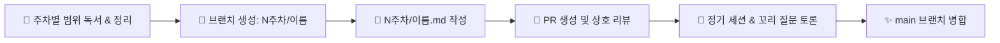

# ⚡️ Frontend Deep-Dive Study

> **《Do it! AI 시대에 살아남는 프런트엔드 면접의 기술》 14주 완성 스터디**  
> 웹 기초(HTML/CSS/JS)부터 React, Next.js, 실무 최적화, 최신 AI 프로젝트 실전까지 109개 핵심 Q&A를 정복합니다.

<br />

<p align="left">
  
  
  
  
</p>

<br />

---

## 📖 도서 챕터 한눈에 보기

<details open>
<summary><strong>📚 전체 8개 장 목차 (총 109개 Q&A)</strong></summary>

- **1장. HTML과 웹 기본 구조** (Doctype, 시맨틱 태그, 웹 표준/접근성, 웹 스토리지)
- **2장. 최신 CSS 기법과 레이아웃** (선택자 우선순위, Flex/Grid, 박스 모델, 반응형 웹)
- **3장. 자바스크립트 핵심과 동작 원리** (실행 컨텍스트, 클로저, 프로토타입, this, 이벤트 루프)
- **4장. 비동기 처리와 웹 API** (Promise, async/await, DOM 조작, 이벤트 버블링/캡처링)
- **5장. React 핵심 원리와 상태 관리** (Virtual DOM, 렌더링 라이프사이클, Custom Hook, 상태 관리)
- **6장. Next.js와 현대 렌더링 전략** (CSR/SSR/SSG/ISR 비교, App Router, 서버 컴포넌트, 캐싱)
- **7장. 실무 프로젝트 지식** (번들러/Vite, 브라우저 렌더링(CRP), Core Web Vitals, TDD, Git Flow)
- **8장. AI 프로젝트 실전** (LLM 지연/환각 대응, 스트리밍 채팅 UI, RAG, 토큰 최적화, SSE vs WebSocket)

</details>

---

## 🧭 스터디 진행 방식



1. **사전 학습 및 정리 제출**
   - 매주 협의된 범위의 질문들을 읽고, 본인의 언어로 정리한 내용을 `N주차/<이름>.md` 파일로 작성합니다.
2. **브랜치 생성 및 PR 등록**
   - 브랜치명: `N주차/<이름>` (예: `1주차/이만재`)
   - PR 제목: `[이름] N주차: <선정 주제 또는 챕터>` (예: `[이만재] 1주차: 1장 HTML과 웹 기본 구조`)
3. **정기 세션 & 모의 면접 토론**
   - 각자 인상 깊었던 질문, 이해가 어려웠던 원리, 실무 꼬리 질문을 함께 토론합니다.
4. **회고 및 Merge**
   - 스터디 세션 종료 후 PR을 `main` 브랜치에 병합합니다.

---

## 🗓️ 14주차 스케줄 (Schedule)

> *주차별 세부 범위는 스터디 진행 상황에 맞춰 논의 후 채워나갑니다.*

| 주차 | 일정 | 학습 범위 / 주제 | 진행 상태 |
| :---: | :---: | :--- | :---: |
| **1주차** | - | 1장. HTML과 웹 기본 구조 | ⏳ 대기중 |
| **2주차** | - | *논의 중 (TBD)* | ⏳ 대기중 |
| **3주차** | - | *논의 중 (TBD)* | ⏳ 대기중 |
| **4주차** | - | *논의 중 (TBD)* | ⏳ 대기중 |
| **5주차** | - | *논의 중 (TBD)* | ⏳ 대기중 |
| **6주차** | - | *논의 중 (TBD)* | ⏳ 대기중 |
| **7주차** | - | *논의 중 (TBD)* | ⏳ 대기중 |
| **8주차** | - | *논의 중 (TBD)* | ⏳ 대기중 |
| **9주차** | - | *논의 중 (TBD)* | ⏳ 대기중 |
| **10주차** | - | *논의 중 (TBD)* | ⏳ 대기중 |
| **11주차** | - | *논의 중 (TBD)* | ⏳ 대기중 |
| **12주차** | - | *논의 중 (TBD)* | ⏳ 대기중 |
| **13주차** | - | *논의 중 (TBD)* | ⏳ 대기중 |
| **14주차** | - | *논의 중 (TBD)* | ⏳ 대기중 |

---

## 📌 규칙 및 컨벤션

- **브랜치 네이밍**: `N주차/<이름>` (예: `1주차/이만재`, `2주차/홍길동`)
- **정리 파일 경로**: `N주차/<이름>.md` (예: `1주차/이만재.md`)
- **커밋 메시지**: `N주차 <이름> 정리 추가` (예: `1주차 이만재 정리 추가`)
- **PR 제목**: `[이름] N주차: <선정 주제/챕터>` (예: `[이만재] 1주차: 1장 HTML과 웹 기본 구조`)

---

## 🤖 AI 에이전트 지원 (Agent Skills)

본 저장소에는 AI 코딩 에이전트가 자동 PR을 생성할 수 있는 스킬이 내장되어 있습니다.  
에이전트에게 아래처럼 지시하면 브랜치 전환부터 PR 등록까지 알아서 진행합니다.

```text
"1주차 정리 올리고 PR 만들어줘"
"1주차 이만재 브랜치로 PR 열어줘"
```

